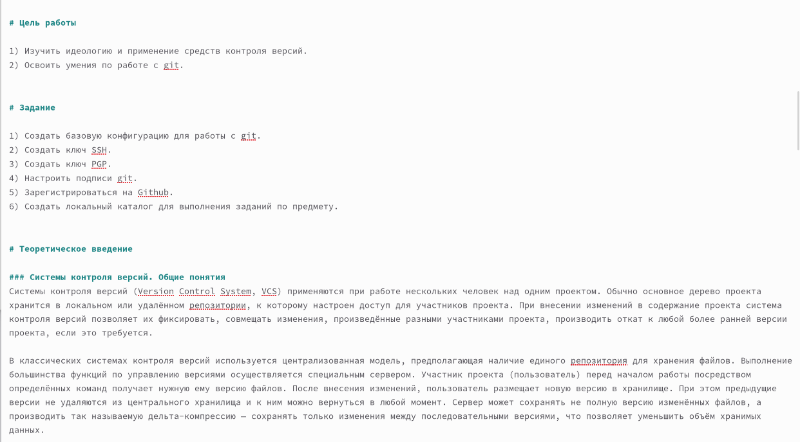
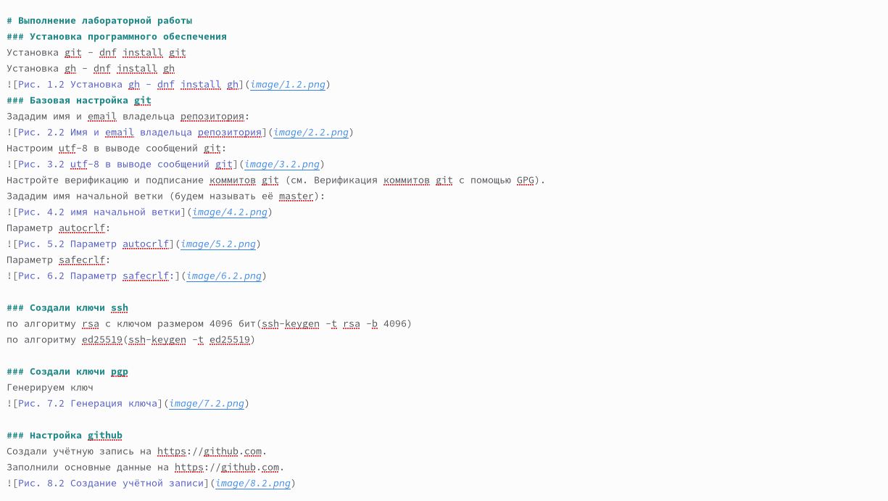
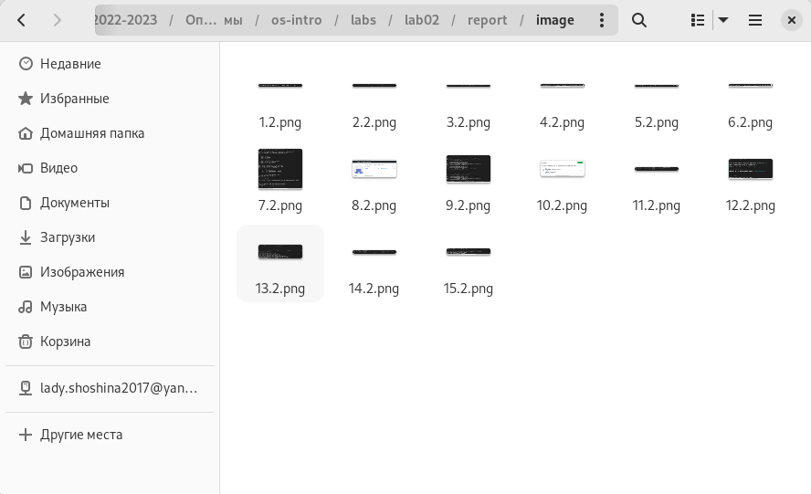
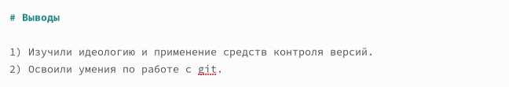
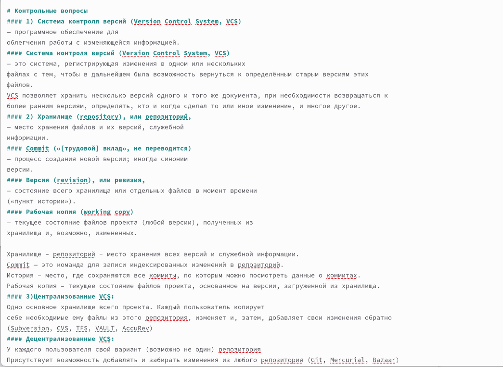
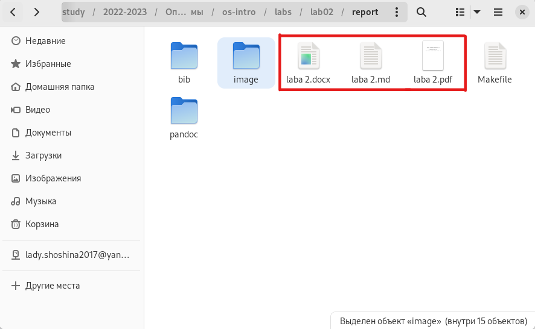
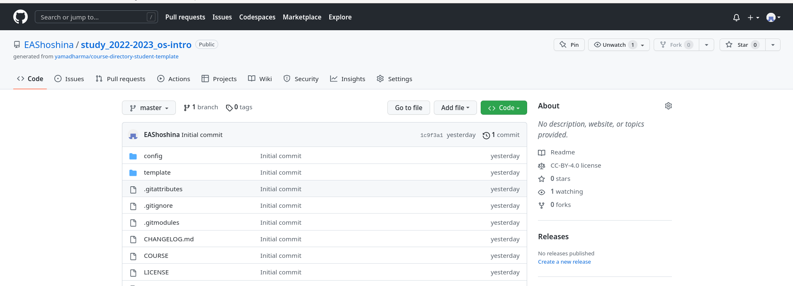

---
## Front matter
lang: ru-RU
title: Отчёт по лабораторной работе №3
subtitle: Дисциплина: Операционные системы
author:
  - Шошина Е.А.
institute:
  - Российский университет дружбы народов, Москва, Россия
date: 24 февраля 2023

## i18n babel
babel-lang: russian
babel-otherlangs: english

## Formatting pdf
toc: false
toc-title: Содержание
slide_level: 2
aspectratio: 169
section-titles: true
theme: metropolis
header-includes:
 - \metroset{progressbar=frametitle,sectionpage=progressbar,numbering=fraction}
 - '\makeatletter'
 - '\beamer@ignorenonframefalse'
 - '\makeatother'
---

# Информация

## Докладчик

:::::::::::::: {.columns align=center}
::: {.column width="70%"}

  * Шошина Евгения Александровна
  * Студент факультета Физико-математических и естественных наук
  * Группа: НКАбд-03-22
  * Российский университет дружбы народов
  * [1132229532@pfur.ru](mailto:1132229532@pfur.ru)
  * <https://EAShoshina.github.io/ru/>

:::

:::
::::::::::::::

# Вводная часть

## Цель

- Научиться оформлять отчёты с помощью легковесного языка разметки Markdown

## Задание
- Сделать отчёт по предыдущей лабораторной работе в формате Markdown.
- В качестве отчёта предоставить отчёты в 3 форматах: pdf, docx и md (в архиве,
поскольку он должен содержать скриншоты, Makefile и т.д.)

# Выполнение лабораторной работы

## Открыли ранее созданный файл lab02 и приступили к созданию отчета. Написали цели и задачи Лабораторной работы.

## Выполнили лабораторную работу

## Сделали скриншоты выполнения по мере выполнения заданий

## Написали вывод

## Ответили на контрольные вопросы

## Сохранили отчет и конвертировали в формат pdf и docx

## Загрузили на GitHub

# Выводы
- Научились оформлять отчёты с помощью легковесного языка разметки Markdown.
