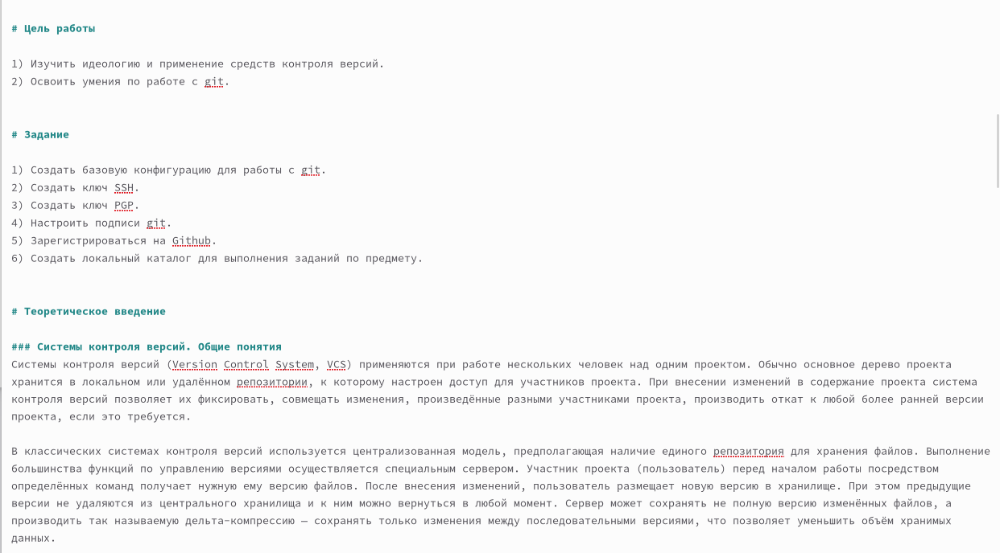
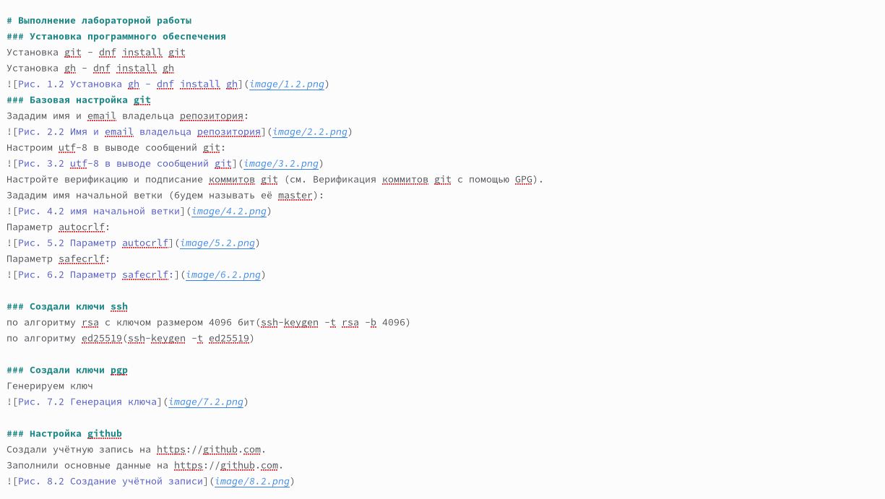
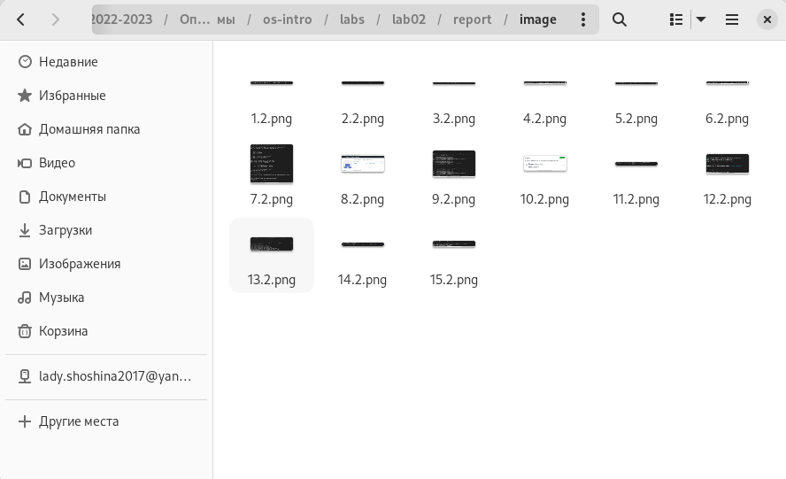
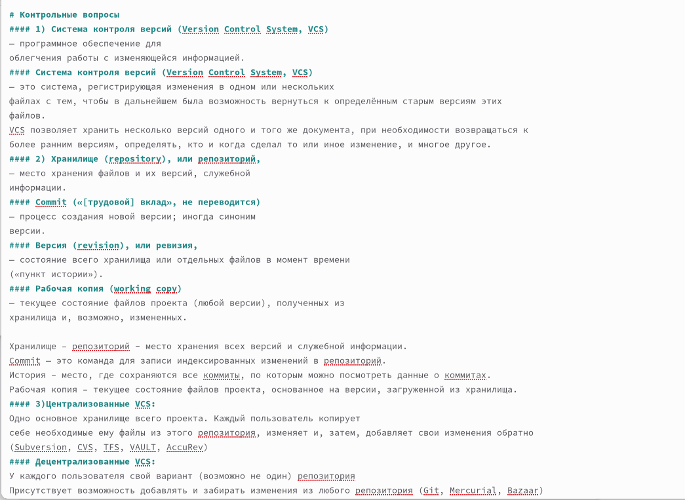
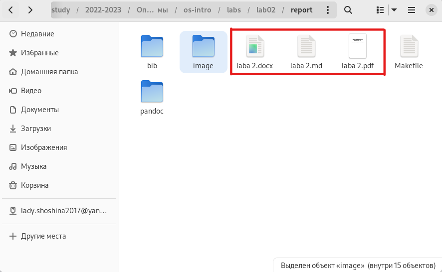
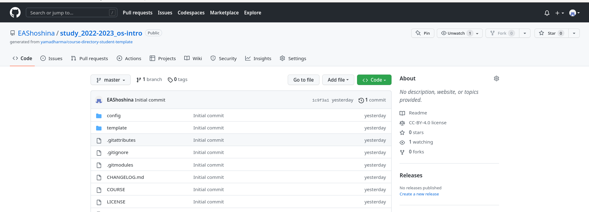

---
## Front matter
title: "Отчёт по лабораторной работе №3"
subtitle: "Дисциплина: Операционные системы"
author: "Шошина Евгения Александровна, группа: НКАбд-03-22"

## Generic otions
lang: ru-RU
toc-title: "Содержание"

## Bibliography
bibliography: bib/cite.bib
csl: pandoc/csl/gost-r-7-0-5-2008-numeric.csl

## Pdf output format
toc: true # Table of contents
toc-depth: 2
lof: true # List of figures
lot: true # List of tables
fontsize: 12pt
linestretch: 1.5
papersize: a4
documentclass: scrreprt
## I18n polyglossia
polyglossia-lang:
  name: russian
  options:
	- spelling=modern
	- babelshorthands=true
polyglossia-otherlangs:
  name: english
## I18n babel
babel-lang: russian
babel-otherlangs: english
## Fonts
mainfont: PT Serif
romanfont: PT Serif
sansfont: PT Sans
monofont: PT Mono
mainfontoptions: Ligatures=TeX
romanfontoptions: Ligatures=TeX
sansfontoptions: Ligatures=TeX,Scale=MatchLowercase
monofontoptions: Scale=MatchLowercase,Scale=0.9
## Biblatex
biblatex: true
biblio-style: "gost-numeric"
biblatexoptions:
  - parentracker=true
  - backend=biber
  - hyperref=auto
  - language=auto
  - autolang=other*
  - citestyle=gost-numeric
## Pandoc-crossref LaTeX customization
figureTitle: "Рис."
tableTitle: "Таблица"
listingTitle: "Листинг"
lofTitle: "Список иллюстраций"
lotTitle: "Список таблиц"
lolTitle: "Листинги"
## Misc options
indent: true
header-includes:
  - \usepackage{indentfirst}
  - \usepackage{float} # keep figures where there are in the text
  - \floatplacement{figure}{H} # keep figures where there are in the text
---

# Цель работы
Научиться оформлять отчёты с помощью легковесного языка разметки Markdown

# Задание

1) Сделать отчёт по предыдущей лабораторной работе в формате Markdown.
2) В качестве отчёта предоставить отчёты в 3 форматах: pdf, docx и md (в архиве,
поскольку он должен содержать скриншоты, Makefile и т.д.)

# Теоретическое введение
## Базовые сведения о Markdown
- Чтобы создать заголовок, используйте знак ( # )
- Чтобы задать для текста полужирное начертание, заключите его в двойные - звездочки(**)
- Чтобы задать для текста курсивное начертание, заключите его в одинарные звездочки(*)
- Чтобы задать для текста полужирное и курсивное начертание, заключите его в тройные
звездочки(***)
- Блоки цитирования создаются с помощью символа >
- Неупорядоченный (маркированный) список можно отформатировать с помощью звездочек или тире
- Чтобы вложить один список в другой, добавьте отступ для элементов дочернего списка
- Упорядоченный список можно отформатировать с помощью соответствующих цифр
- Чтобы вложить один список в другой, добавьте отступ для элементов дочернего списка
- Синтаксис Markdown для встроенной ссылки состоит из части [link text] , представ-
ляющей текст гиперссылки, и части (file-name.md) – URL-адреса или имени файла,
на который дается ссылка
- Markdown поддерживает как встраивание фрагментов кода в предложение, так и их
размещение между предложениями в виде отдельных огражденных блоков. Огражденные
блоки кода — это простой способ выделить синтаксис для фрагментов кода. Общий
формат огражденных блоков кода
- Верхние (~) и нижние (^) индексы 
- Внутритекстовые формулы делаются аналогично формулам LaTeX. Например, формула
sin2(𝑥) + cos2(𝑥) = 1 запишется как $\sin^2 (x) + \cos^2 (x) = 1$
Выключные формулы: {#eq:eq:sin2+cos2} со ссылкой в тексте "Смотри формулу"

## Обработка файлов в формате Markdown
Для обработки файлов в формате Markdown будем использовать Pandoc
https://pandoc.org/. Конкретно, нам понадобится программа pandoc ,
pandoc-citeproc https://github.com/jgm/pandoc/releases, pandoc-crossref
https://github.com/lierdakil/pandoc-crossref/releases.
Преобразовать файл README.md можно следующим образом: pandoc README.md -o README.pdf
или так pandoc README.md -o README.docx

## Оформление отчета по лабораторной работе
Лабораторная работа является небольшой научно-исследовательской работой, которую
и оформлять следует по всем утверждённым требованиям. При подготовке отчета по ла
бораторной работе вы освоите ряд важных элементов, которые в дальнейшем пригодятся
вам при написании курсовой и дипломной работы.

## Структура отчёта
Согласно ГОСТ 7.32-2001, любая научно-исследовательская работа должна обязательно
содержать следующие элементы:
– титульный лист;
– реферат;
– введение;
– основную часть;
– заключение.
Также ГОСТ рекомендует включить в работу и такие элементы:
– список исполнителей;
– содержание;
– нормативные ссылки;
– определения;
– обозначения и сокращения;
– список использованных источников;
– приложения.
Если вы проводите сложную работу, выполняемую в несколько этапов, то вам может
понадобиться включить в работу часть или все элементы второго списка.

## Содержание основных элементов отчета
– Титульный лист. Первый лист работы оформляется строго по образцу, который обычно
приводится в методических пособиях по вашему предмету. В нем не просто требуется
указать такие элементы, как название образовательного учреждения, вид работы
и сведения об исполнителе, но и расположить их в строгом соответствии со стандарта-
ми.
– Реферат. Реферат фактически является кратким представлением всего вашего отчета
и содержит ряд статистических сведений. В нем нужно указать количество частей,
страниц работы, иллюстраций, приложений, таблиц, использованных литературных
источников и приложений. Здесь же приводится перечень ключевых слов работы
и собственно текст реферата. Последний подразумевает основные элементы работы
от поставленных целей до результатов и рекомендаций по их внедрению. В практике
вузов в отчеты по лабораторным работам реферат обычно не включают.
– Введение. Во введении типовой лабораторной работы обычно прописывают цели
проводимого исследования и задачи, выполнение которых поможет достичь постав-
ленных целей. В то же время существуют работы, в которых студенты становятся
настоящими первооткрывателями. Приходилось ли вам хотя бы однажды испытывать
чувство крайнего любопытства и нетерпения при проведении лабораторной работы?
Ощущать, что буквально через пару минут вы найдете ответ на вопрос, на который
еще никто и никогда не находил ответа? Именно для таких исследований пишется развернутое введение с доказательством актуальности и новизны изучаемой темы. Чтобы
действительно провести исследование в той области, в которой, как говорится, еще не
ступала нога человека, во введении вам понадобится привести оценку современного
состояния рассматриваемой проблемы и обосновать необходимость ее решения.
– Основная часть. Так как в разных вузах и в разных дисциплинах существуют свои
тонкости проведения лабораторных работ, содержание основной части подробно
описывают в соответствующих методичках. Важно, чтобы в этом разделе работы была
отражена ее суть, описана методика и результаты проделанной работы.
В основной части прописывают следующие элементы:
– цели проводимого исследования;
– задачи, выполнение которых поможет достичь поставленных целей;
– ход работы, в котором описываются выполненные действия;
– прочие разделы, предусмотренные методическими материалами по изучаемой
дисциплине.
– Заключение. В этой части работы вам потребуется сделать выводы по полученным в ходе лабораторной работы результатам. Для этого оцените, насколько полно выполнены
поставленные задачи. В сложных работах могут присутствовать и другие элементы,
например, рекомендации для дальнейшего применения результатов проведённой
работы.

# Выполнение лабораторной работы

##### Открыли ранее созданный файл lab02 и приступили к созданию отчета

##### Написали цели и задачи Лабораторной работы

##### Выполнили лабораторную работу

##### Сделали скриншоты выполнения по мере выполнения заданий

##### Написали вывод

##### Ответили на контрольные вопросы

##### Сохранили отчет и конвертировали в формат pdf и docx

##### Загрузили на GitHub

# Выводы
Научились оформлять отчёты с помощью легковесного языка разметки Markdown.

