---
## Front matter
lang: ru-RU
title: Презентация по лабораторной работе №6
subtitle: "Дисциплина: Операционные системы"
author:
  - Шошина Е.А.
institute:
  - Российский университет дружбы народов, Москва, Россия
date: 14 марта 2023

## i18n babel
babel-lang: russian
babel-otherlangs: english

## Formatting pdf
toc: false
toc-title: Содержание
slide_level: 2
aspectratio: 169
section-titles: true
theme: metropolis
header-includes:
 - \metroset{progressbar=frametitle,sectionpage=progressbar,numbering=fraction}
 - '\makeatletter'
 - '\beamer@ignorenonframefalse'
 - '\makeatother'
---

# Информация

## Докладчик

:::::::::::::: {.columns align=center}
::: {.column width="70%"}

  * Шошина Евгения Александровна
  * группа: НКАбд-03-22
  * студент факультета физико-математических и естественных наук
  * Российский университет дружбы народов
  * [1132229532@pfur.ru](mailto:1132229532@pfur.ru)
  * <https://EAShoshina.github.io/ru/>

:::
::: {.column width="30%"}

:::
::::::::::::::

# Вводная часть

## Цель

Ознакомление с инструментами поиска файлов и фильтрации текстовых данных. Приобретение практических навыков: по управлению процессами (и заданиями), по проверке использования диска и обслуживанию файловых систем.

## Задание

1. Осуществите вход в систему, используя соответствующее имя пользователя.
2. Запишите в файл file.txt названия файлов, содержащихся в каталоге /etc. Допишите в этот же файл названия файлов, содержащихся в вашем домашнем каталоге.
3. Выведите имена всех файлов из file.txt, имеющих расширение .conf, после чего запишите их в новый текстовой файл conf.txt.
4. Определите, какие файлы в вашем домашнем каталоге имеют имена, начинавшиеся с символа c? Предложите несколько вариантов, как это сделать.
5. Выведите на экран (по странично) имена файлов из каталога /etc, начинающиеся с символа h.

## Задание

6. Запустите в фоновом режиме процесс, который будет записывать в файл ~/logfile файлы, имена которых начинаются с log.
7. Удалите файл ~/logfile.
8. Запустите из консоли в фоновом режиме редактор gedit.
9. Определите идентификатор процесса gedit, используя команду ps, конвейер и фильтр grep. Как ещё можно определить идентификатор процесса?
10. Прочтите справку (man) команды kill, после чего используйте её для завершения процесса gedit.
11. Выполните команды df и du, предварительно получив более подробную информацию об этих командах, с помощью команды man.
12. Воспользовавшись справкой команды find, выведите имена всех директорий, имеющихся в вашем домашнем каталоге.

# Выполнение лабораторной работы

## 1. Осуществили вход в систему, используя соответствующее имя пользователя. 2. Записали в файл file.txt названия файлов, содержащихся в каталоге /etc. 

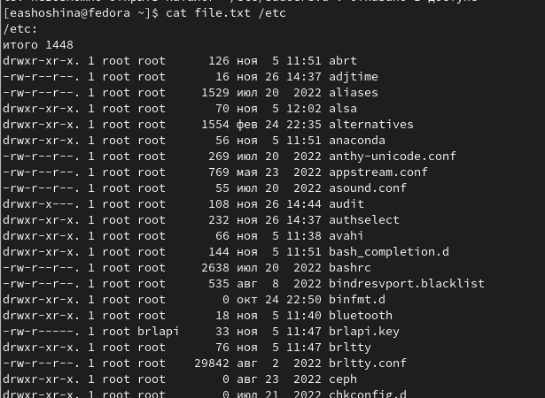

## Дописали в этот же файл названия файлов, содержащихся в вашем домашнем каталоге.

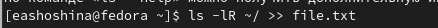

## 3. Вывели имена всех файлов из file.txt, имеющих расширение .conf.

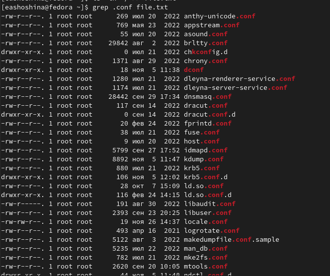

## Записали их в новый текстовой файл conf.txt.

## 4. Определили, какие файлы в вашем домашнем каталоге имеют имена, начинавшиеся с символа c? 

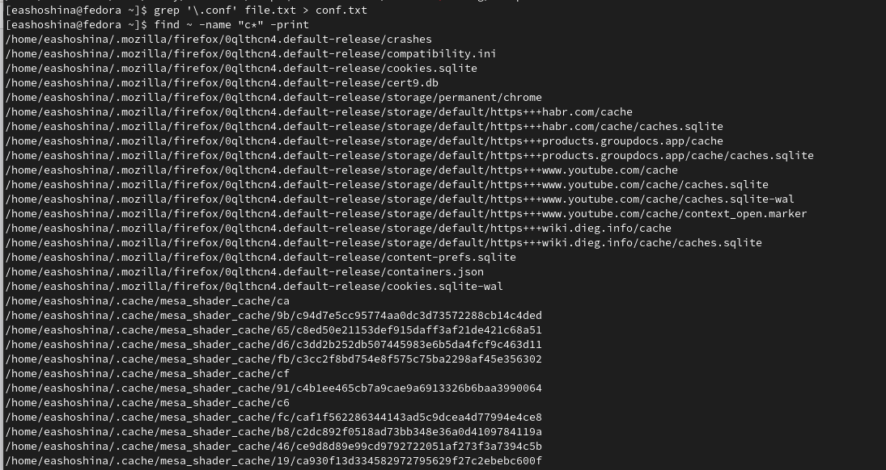

## 4. Определили, какие файлы в вашем домашнем каталоге имеют имена, начинавшиеся с символа c? 

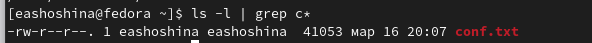

## 5. Вывели на экран (пос транично) имена файлов из каталога /etc, начинающиеся с символа h.

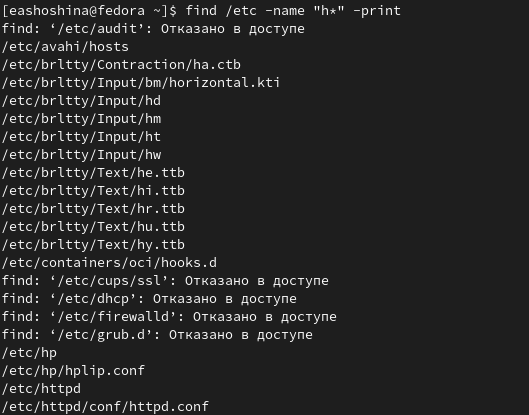

## 6. Запустили в фоновом режиме процесс, который будет записывать в файл ~/logfile файлы, имена которых начинаются с log.

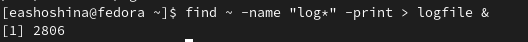

## 7. Удалили файл ~/logfile.

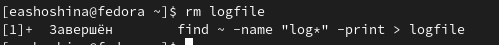

## 8. Запустили из консоли в фоновом режиме редактор gedit.

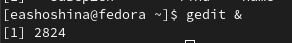

## 9. Определили идентификатор процесса gedit, используя команду ps, конвейер и фильтр grep. Как ещё можно определить идентификатор процесса?

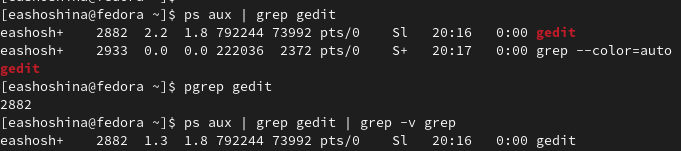

## 10. Прочитали справку (man) команды kill, после чего использовали её для завершения процесса gedit.

## 11. Выполнили команду man du

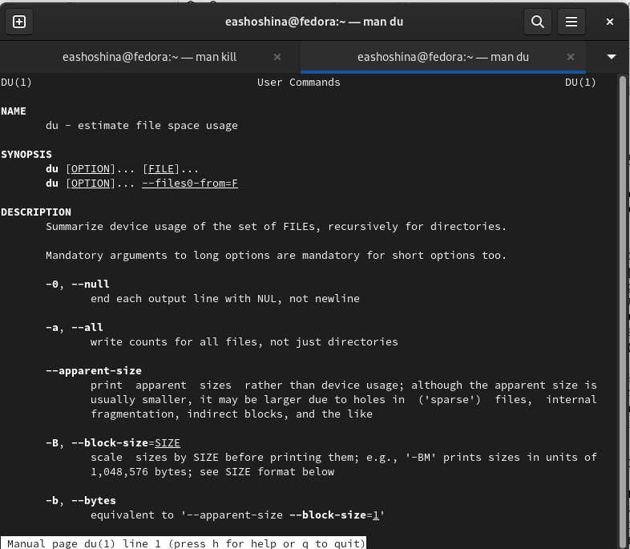

## 11. Выполнили команду man df

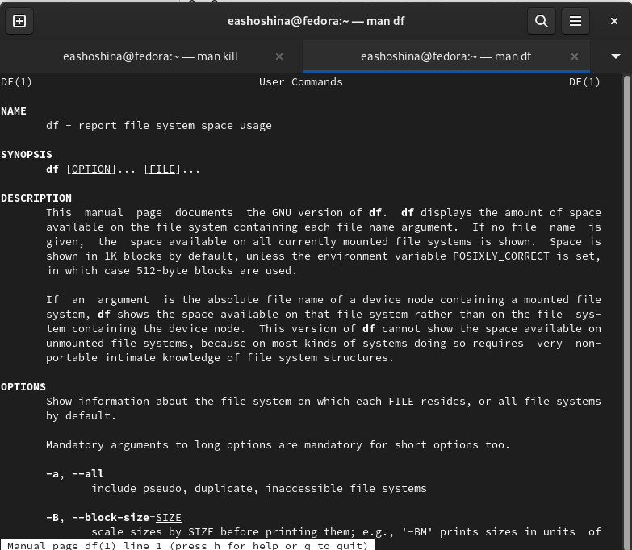

## 11. Выполнили команду df- vi

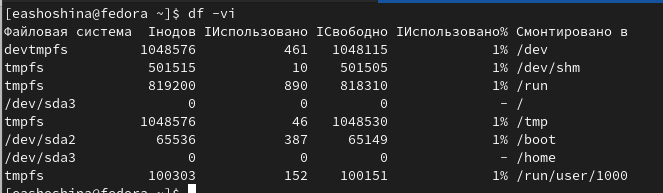

## 11. Выполнили команду du -a

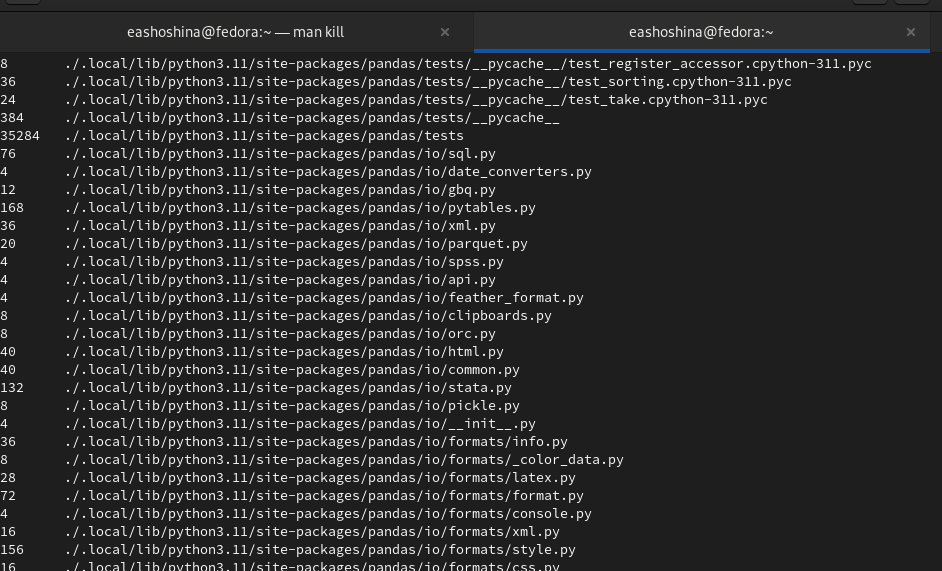

## 12. Воспользовались справкой команды find, вывели имена всех директорий, имеющихся в вашем домашнем каталоге.

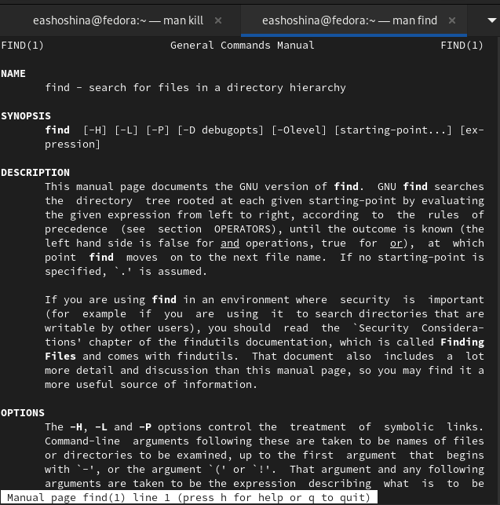

## 12. Воспользовались справкой команды find, вывели имена всех директорий, имеющихся в вашем домашнем каталоге.

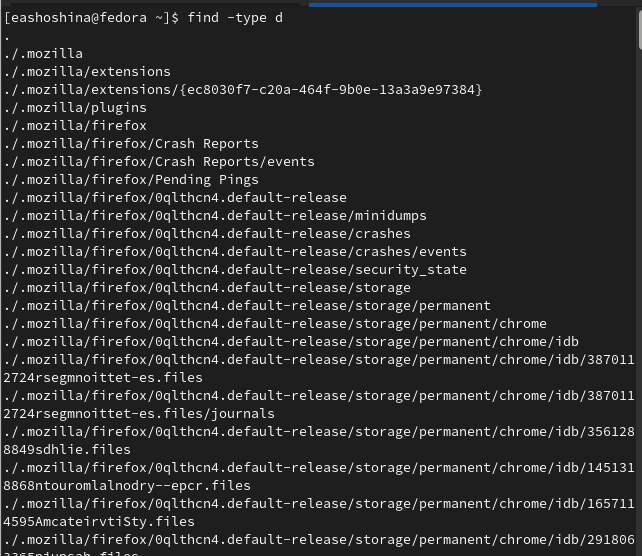

# Выводы

Ознакомились с инструментами поиска файлов и фильтрации текстовых данных.
Приобрели практические навыки: по управлению процессами (и заданиями), по проверке использования диска и обслуживанию файловых систем.

# Контрольные вопросы

## 1. Какие потоки ввода вывода вы знаете?

В системе по умолчанию открыто три специальных потока:
- stdin — стандартный поток ввода (по умолчанию: клавиатура), файловый дескриптор 0;
- stdout — стандартный поток вывода (по умолчанию: консоль), файловый дескриптор 1;
- stderr — стандартный поток вывод сообщений об ошибках (по умолчанию: консоль), файловый дескриптор 2.
Большинство используемых в консоли команд и программ записывают результаты своей работы в стандартный поток вывода stdout. Например, команда ls выводит в стандартный поток вывода (консоль) список файлов в текущей директории. Потоки вывода и ввода можно перенаправлять на другие файлы или устройства. Проще всего это делается с помощью символов >, >>, <, <<. 

## 2. Объясните разницу между операцией > и >>.

- В Bash знак больше > обозначает перенаправление стандартного потока вывода. В данном случае в файл. То есть cat по-умолчанию выводит данные на экран, но поскольку они были перенаправлены, то данные на экран выводиться не будут. На экране видны только вводимые строки, выводимые оказываются в файле.
Два знака больше >> – это тоже перенаправление вывода, но такое, когда данные добавляются в конец объекта (в данном случае файла), если он существует. Используй мы только один знак больше, файл был бы перезаписан.

## 3. Что такое конвейер?

- Конвейер (pipe) служит для объединения простых команд или утилит в цепочки, в которых результат работы предыдущей команды передаётся последующей. Синтаксис следующий:
1 команда 1 | команда 2
2 # означает, что вывод команды 1 передастся на ввод команде 2
Конвейеры можно группировать в цепочки и выводить с помощью перенаправления в файл, например:
1 ls -la |sort > sortilg_list
вывод команды ls -la передаётся команде сортировки sort\verb, которая пишет результат в файл sorting_list\verb.

## 4. Что такое процесс? Чем это понятие отличается от программы?

Программа и процесс актуальны, но отличаются. Программа - это всего лишь сценарий, хранящийся на диске или, по-видимому, предыдущий этап процесса. Наоборот, процесс является событием программы в процессе выполнения.
Команда ps используется для получения информации о процессах.
Для получения информации о процессах, управляемых вами и запущенных (работающих или остановленных) на вашем терминале, используйте опцию aux.

## 5. Что такое PID и GID?

- Идентификатор процесса (PID).
Каждому новому процессу ядро  присваивает уникальный идентификационный номер. В
любой момент времени идентификатор процесса является уникальным, хотя после
завершения процесса он может использоваться снова для другого процесса.
Некоторые идентификаторы зарезервированы системой для особых процессов. Так,
процесс с идентификатором 1 - это процесс инициализации init, являющийся предком
всех других процессов в системе.
- Идентификатор группы GID и эффективный идентификатор группы (EGID)
GID - это идентификационный номер группы данного процесса. EGID связан с GID
также, как EUID с UID.

## 6. Что такое задачи и какая команда позволяет ими управлять?

Любую выполняющуюся в консоли команду или внешнюю программу можно запустить в фоновом режиме. Для этого следует в конце имени команды указать знак амперсанда &. 

## 7. Найдите информацию об утилитах top и htop. Каковы их функции?

- top — самая простая и самуая распространённая утилита из этого списка. Показывает примерно то же, что утилита vmstat, плюс рейтинг процессов по потреблению памяти или процессора. Совсем ничего не знает про загрузку сети или дисков. Позволяет минимальный набор операций с процессом: renice, kill.
- htop не собирает статистику и просто показывает текущее состояние. Второе яркое отличие — нортоноподобная панелька с подсказками кнопок снизу и возможность «навигации» по списку процессов.

## 8. Назовите и дайте характеристику команде поиска файлов. Приведите примеры использования этой команды.

-  find : Для поиска файлов из командной строки вы можете использовать команду “find”. У этой команды следующий синтаксис:
find path criteria action
“path” - Секция для указания директории поиска. Если ничего не указано поиск идет по текущей директории.
“criteria” - Опции поиска.
“action” -Опции, которые влияют на состояние поиска или контролируют его, например,
“–print”

## 9. Можно ли по контексту (содержанию) найти файл? Если да, то как?

- Для поиска файла по содержимому проще всего воспользоваться командой grep (вместо find).

## 10. Как определить объем свободной памяти на жёстком диске?

-Команда df — сокращенное «disk-free», показывает доступное и используемое дисковое пространство в системе Linux.

## 11. Как определить объем вашего домашнего каталога?

- Для просмотра размеров папок на диске используется команда du. Если просто ввести команду без каких либо аргументов, то она рекурсивно проскандирует вашу текущую директорию и выведет размеры всех файлов в ней. Обычно для du указывают путь до папки, которую вы хотите проанализировать.

## 12. Как удалить зависший процесс?

- Когда известен PID процесса, мы можем убить его командой kill. 
- Утилита pkill - это оболочка для kill, она ведет себя точно так же, и имеет тот же синтаксис, только в качестве идентификатора процесса ей нужно передать его имя. 
- Команда killall в Linux предназначена для «убийства» всех процессов, имеющих одно и то же имя. 

