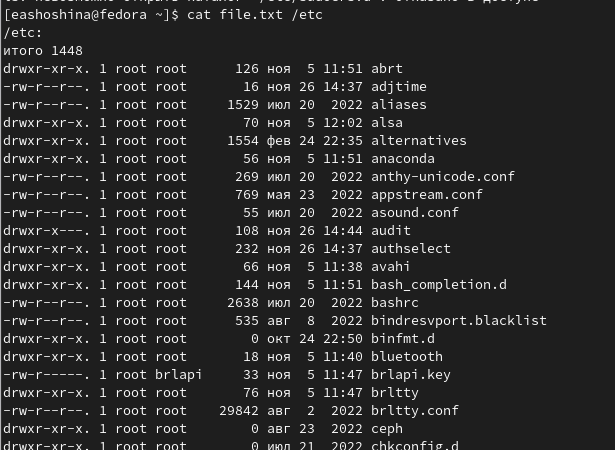
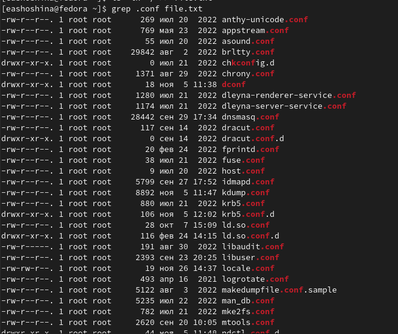

---
## Front matter
title: "Отчет по лабораторной работе №6"
subtitle: "Дисциплина: Операционные системы"
author: "Шошина Евгения Александровна (НКАбд-03-22)"

## Generic otions
lang: ru-RU
toc-title: "Содержание"

## Bibliography
bibliography: bib/cite.bib
csl: pandoc/csl/gost-r-7-0-5-2008-numeric.csl

## Pdf output format
toc: true # Table of contents
toc-depth: 2
lof: true # List of figures
lot: true # List of tables
fontsize: 12pt
linestretch: 1.5
papersize: a4
documentclass: scrreprt
## I18n polyglossia
polyglossia-lang:
  name: russian
  options:
	- spelling=modern
	- babelshorthands=true
polyglossia-otherlangs:
  name: english
## I18n babel
babel-lang: russian
babel-otherlangs: english
## Fonts
mainfont: PT Serif
romanfont: PT Serif
sansfont: PT Sans
monofont: PT Mono
mainfontoptions: Ligatures=TeX
romanfontoptions: Ligatures=TeX
sansfontoptions: Ligatures=TeX,Scale=MatchLowercase
monofontoptions: Scale=MatchLowercase,Scale=0.9
## Biblatex
biblatex: true
biblio-style: "gost-numeric"
biblatexoptions:
  - parentracker=true
  - backend=biber
  - hyperref=auto
  - language=auto
  - autolang=other*
  - citestyle=gost-numeric
## Pandoc-crossref LaTeX customization
figureTitle: "Рис."
tableTitle: "Таблица"
listingTitle: "Листинг"
lofTitle: "Список иллюстраций"
lotTitle: "Список таблиц"
lolTitle: "Листинги"
## Misc options
indent: true
header-includes:
  - \usepackage{indentfirst}
  - \usepackage{float} # keep figures where there are in the text
  - \floatplacement{figure}{H} # keep figures where there are in the text
---

# Цель работы

Ознакомление с инструментами поиска файлов и фильтрации текстовых данных. Приобретение практических навыков: по управлению процессами (и заданиями), по проверке использования диска и обслуживанию файловых систем.

# Задание

1. Осуществите вход в систему, используя соответствующее имя пользователя.
2. Запишите в файл file.txt названия файлов, содержащихся в каталоге /etc. Допишите в этот же файл названия файлов, содержащихся в вашем домашнем каталоге.
3. Выведите имена всех файлов из file.txt, имеющих расширение .conf, после чего запишите их в новый текстовой файл conf.txt.
4. Определите, какие файлы в вашем домашнем каталоге имеют имена, начинавшиеся с символа c? Предложите несколько вариантов, как это сделать.
5. Выведите на экран (по странично) имена файлов из каталога /etc, начинающиеся с символа h.
6. Запустите в фоновом режиме процесс, который будет записывать в файл ~/logfile файлы, имена которых начинаются с log.
7. Удалите файл ~/logfile.
8. Запустите из консоли в фоновом режиме редактор gedit.
9. Определите идентификатор процесса gedit, используя команду ps, конвейер и фильтр grep. Как ещё можно определить идентификатор процесса?
10. Прочтите справку (man) команды kill, после чего используйте её для завершения процесса gedit.
11. Выполните команды df и du, предварительно получив более подробную информацию об этих командах, с помощью команды man.
12. Воспользовавшись справкой команды find, выведите имена всех директорий, имеющихся в вашем домашнем каталоге.

# Теоретическое введение

## Перенаправление ввода-вывода
В системе по умолчанию открыто три специальных потока:
- stdin — стандартный поток ввода (по умолчанию: клавиатура), файловый дескриптор 0;
- stdout — стандартный поток вывода (по умолчанию: консоль), файловый дескриптор 1;
- stderr — стандартный поток вывод сообщений об ошибках (по умолчанию: консоль), файловый дескриптор 2.
Большинство используемых в консоли команд и программ записывают результаты своей работы в стандартный поток вывода stdout. Например, команда ls выводит в стандартный поток вывода (консоль) список файлов в текущей директории. Потоки вывода и ввода можно перенаправлять на другие файлы или устройства. Проще всего это делается с помощью символов >, >>, <, <<. Рассмотрим пример.

Перенаправление stdout (вывода) в файл.
2 # Если файл отсутствовал, то он создаётся,
3 # иначе -- перезаписывается.
4
5 # Создаёт файл, содержащий список дерева каталогов.
6 ls -lR > dir-tree.list
7
8 1>filename
9 # Перенаправление вывода (stdout) в файл "filename".
10 1>>filename
11 # Перенаправление вывода (stdout) в файл "filename",
12 # файл открывается в режиме добавления.
13 2>filename
14 # Перенаправление stderr в файл "filename".
15 2>>filename
16 # Перенаправление stderr в файл "filename",
17 # файл открывается в режиме добавления.
18 &>filename
19 # Перенаправление stdout и stderr в файл "filename".

## Конвейер

Конвейер (pipe) служит для объединения простых команд или утилит в цепочки, в которых результат работы предыдущей команды передаётся последующей. Синтаксис следующий:
1 команда 1 | команда 2
2 # означает, что вывод команды 1 передастся на ввод команде 2
Конвейеры можно группировать в цепочки и выводить с помощью перенаправления в файл, например:
1 ls -la |sort > sortilg_list
вывод команды ls -la передаётся команде сортировки sort\verb, которая пишет результат в файл sorting_list\verb.
Чаще всего скрипты на Bash используются в качестве автоматизации каких-то рутинных операций в консоли, отсюда иногда возникает необходимость в обработке stdout
одной команды и передача на stdin другой команде, при этом результат выполнения команды должен обработан.

## Поиск файла

Команда find используется для поиска и отображения на экран имён файлов, соответствующих заданной строке символов.
Формат команды:
1 find путь [-опции]
Путь определяет каталог, начиная с которого по всем подкаталогам будет вестись поиск.
Примеры:
1. Вывести на экран имена файлов из вашего домашнего каталога и его подкаталогов, начинающихся на f:
1 find ~ -name "f*" -print
Здесь ~ — обозначение вашего домашнего каталога, -name — после этой опции указывается имя файла, который нужно найти, "f*" — строка символов, определяющая имя файла, -print — опция, задающая вывод результатов поиска на экран.
2. Вывести на экран имена файлов в каталоге /etc, начинающихся с символа p:
1 find /etc -name "p*" -print
3. Найти в Вашем домашнем каталоге файлы, имена которых заканчиваются символом ~ и удалить их:
1 find ~ -name "*~" -exec rm "{}" \;
Здесь опция -exec rm "{}" \; задаёт применение команды rm ко всем файлам, имена которых соответствуют указанной после опции -name строке символов.
Для просмотра опций команды find воспользуйтесь командой man.

## Фильтрация текста

Найти в текстовом файле указанную строку символов позволяет команда grep.
Формат команды:
1 grep строка имя_файла
Кроме того, команда grep способна обрабатывать стандартный вывод других команд (любой текст). Для этого следует использовать конвейер, связав вывод команды с вводом grep.
Примеры:
1. Показать строки во всех файлах в вашем домашнем каталоге с именами, начинающи-
мися на f, в которых есть слово begin:
1 grep begin f*
2. Найти в текущем каталоге все файлы, содержащих в имени «лаб»:
1 ls -l | grep лаб

## Проверка использования диска

Команда df показывает размер каждого смонтированного раздела диска.
Формат команды:
1 df [-опции] [файловая_система]
Пример:
1 df -vi
Команда du показывает число килобайт, используемое каждым файлом или каталогом.
Формат команды:
1 du [-опции] [имя_файла...]
Пример.
1 du -a ~/
На afs можно посмотреть использованное пространство командой
1 fs quota

## Управление задачами

Любую выполняющуюся в консоли команду или внешнюю программу можно запустить в фоновом режиме. Для этого следует в конце имени команды указать знак амперсанда &. Например:
1 gedit &
Будет запущен текстовой редактор gedit в фоновом режиме. Консоль при этом не будет заблокирована.
Запущенные фоном программы называются задачами (jobs). Ими можно управлять с помощью команды jobs, которая выводит список запущенных в данный момент задач.
Для завершения задачи необходимо выполнить команду
1 kill %номер задачи

## Управление процессами

Любой команде, выполняемой в системе, присваивается идентификатор процесса (process ID). Получить информацию о процессе и управлять им, пользуясь идентификатором процесса, можно из любого окна командного интерпретатора.

## Получение информации о процессах

Команда ps используется для получения информации о процессах.
Формат команды:
1 ps [-опции]
Для получения информации о процессах, управляемых вами и запущенных (работающих или остановленных) на вашем терминале, используйте опцию aux.
Пример:
1 ps aux
Для запуска команды в фоновом режиме необходимо в конце командной строки указать знак & (амперсанд).
Пример работы, требующей много машинного времени для выполнения, и которую целесообразно запустить в фоновом режиме:
1 find /var/log -name "*.log" -print > l.log &

# Выполнение лабораторной работы

1. Осуществили вход в систему, используя соответствующее имя пользователя.

2. Записали в файл file.txt названия файлов, содержащихся в каталоге /etc. Дописали в этот же файл названия файлов, содержащихся в вашем домашнем каталоге.

3. Вывели имена всех файлов из file.txt, имеющих расширение .conf, после чего записали их в новый текстовой файл conf.txt.

4. Определили, какие файлы в вашем домашнем каталоге имеют имена, начинавшиеся с символа c? Предложили несколько вариантов, как это сделать.

5. Вывели на экран (пос транично) имена файлов из каталога /etc, начинающиеся с символа h.

6. Запустили в фоновом режиме процесс, который будет записывать в файл ~/logfile файлы, имена которых начинаются с log.

7. Удалили файл ~/logfile.

8. Запустили из консоли в фоновом режиме редактор gedit.

9. Определили идентификатор процесса gedit, используя команду ps, конвейер и фильтр grep. Как ещё можно определить идентификатор процесса?

10. Прочитали справку (man) команды kill, после чего использовали её для завершения процесса gedit.

11. Выполнили команды df и du, предварительно получив более подробную информацию об этих командах, с помощью команды man.

12. Воспользовались справкой команды find, вывели имена всех директорий, имеющихся в вашем домашнем каталоге.

{.column width="30%"}

# Выводы

Ознакомились с инструментами поиска файлов и фильтрации текстовых данных.
Приобрели практические навыки: по управлению процессами (и заданиями), по проверке использования диска и обслуживанию файловых систем.

# Контрольные вопросы

1. Какие потоки ввода вывода вы знаете?
В системе по умолчанию открыто три специальных потока:
- stdin — стандартный поток ввода (по умолчанию: клавиатура), файловый дескриптор 0;
- stdout — стандартный поток вывода (по умолчанию: консоль), файловый дескриптор 1;
- stderr — стандартный поток вывод сообщений об ошибках (по умолчанию: консоль), файловый дескриптор 2.
Большинство используемых в консоли команд и программ записывают результаты своей работы в стандартный поток вывода stdout. Например, команда ls выводит в стандартный поток вывода (консоль) список файлов в текущей директории. Потоки вывода и ввода можно перенаправлять на другие файлы или устройства. Проще всего это делается с помощью символов >, >>, <, <<. Рассмотрим пример.
1 # Перенаправление stdout (вывода) в файл.
2 # Если файл отсутствовал, то он создаётся,
3 # иначе -- перезаписывается.
4
5 # Создаёт файл, содержащий список дерева каталогов.
6 ls -lR > dir-tree.list
7
8 1>filename
9 # Перенаправление вывода (stdout) в файл "filename".
10 1>>filename
11 # Перенаправление вывода (stdout) в файл "filename",
12 # файл открывается в режиме добавления.
13 2>filename
14 # Перенаправление stderr в файл "filename".
15 2>>filename
16 # Перенаправление stderr в файл "filename",
17 # файл открывается в режиме добавления.
18 &>filename
19 # Перенаправление stdout и stderr в файл "filename".

2. Объясните разницу между операцией > и >>.
- В Bash знак больше > обозначает перенаправление стандартного потока вывода. В данном случае в файл. То есть cat по-умолчанию выводит данные на экран, но поскольку они были перенаправлены, то данные на экран выводиться не будут. На экране видны только вводимые строки, выводимые оказываются в файле.
Два знака больше >> – это тоже перенаправление вывода, но такое, когда данные добавляются в конец объекта (в данном случае файла), если он существует. Используй мы только один знак больше, файл был бы перезаписан.

3. Что такое конвейер?
- Конвейер (pipe) служит для объединения простых команд или утилит в цепочки, в которых результат работы предыдущей команды передаётся последующей. Синтаксис следующий:
1 команда 1 | команда 2
2 # означает, что вывод команды 1 передастся на ввод команде 2
Конвейеры можно группировать в цепочки и выводить с помощью перенаправления в файл, например:
1 ls -la |sort > sortilg_list
вывод команды ls -la передаётся команде сортировки sort\verb, которая пишет результат в файл sorting_list\verb.

4. Что такое процесс? Чем это понятие отличается от программы?
Программа и процесс актуальны, но отличаются. Программа - это всего лишь сценарий, хранящийся на диске или, по-видимому, предыдущий этап процесса. Наоборот, процесс является событием программы в процессе выполнения.
Команда ps используется для получения информации о процессах.
Для получения информации о процессах, управляемых вами и запущенных (работающих или остановленных) на вашем терминале, используйте опцию aux.

5. Что такое PID и GID?
- Идентификатор процесса (PID).
Каждому новому процессу ядро  присваивает уникальный идентификационный номер. В
любой момент времени идентификатор процесса является уникальным, хотя после
завершения процесса он может использоваться снова для другого процесса.
Некоторые идентификаторы зарезервированы системой для особых процессов. Так,
процесс с идентификатором 1 - это процесс инициализации init, являющийся предком
всех других процессов в системе.
- Идентификатор группы GID и эффективный идентификатор группы (EGID)
GID - это идентификационный номер группы данного процесса. EGID связан с GID
также, как EUID с UID.

6. Что такое задачи и какая команда позволяет ими управлять?
Любую выполняющуюся в консоли команду или внешнюю программу можно запустить в фоновом режиме. Для этого следует в конце имени команды указать знак амперсанда &. 

7. Найдите информацию об утилитах top и htop. Каковы их функции?
- top — самая простая и самуая распространённая утилита из этого списка. Показывает примерно то же, что утилита vmstat, плюс рейтинг процессов по потреблению памяти или процессора. Совсем ничего не знает про загрузку сети или дисков. Позволяет минимальный набор операций с процессом: renice, kill.
- htop не собирает статистику и просто показывает текущее состояние. Второе яркое отличие — нортоноподобная панелька с подсказками кнопок снизу и возможность «навигации» по списку процессов.

8. Назовите и дайте характеристику команде поиска файлов. Приведите примеры использования этой команды.
-  find : Для поиска файлов из командной строки вы можете использовать команду “find”. У этой команды следующий синтаксис:
find path criteria action
“path” - Секция для указания директории поиска. Если ничего не указано поиск идет по текущей директории.
“criteria” - Опции поиска.
“action” -Опции, которые влияют на состояние поиска или контролируют его, например,
“–print”

9. Можно ли по контексту (содержанию) найти файл? Если да, то как?
- Для поиска файла по содержимому проще всего воспользоваться командой grep (вместо find).

10. Как определить объем свободной памяти на жёстком диске?
-Команда df — сокращенное «disk-free», показывает доступное и используемое дисковое пространство в системе Linux.

11. Как определить объем вашего домашнего каталога?
- Для просмотра размеров папок на диске используется команда du. Если просто ввести команду без каких либо аргументов, то она рекурсивно проскандирует вашу текущую директорию и выведет размеры всех файлов в ней. Обычно для du указывают путь до папки, которую вы хотите проанализировать.

12. Как удалить зависший процесс?
- Когда известен PID процесса, мы можем убить его командой kill. 
- Утилита pkill - это оболочка для kill, она ведет себя точно так же, и имеет тот же синтаксис, только в качестве идентификатора процесса ей нужно передать его имя. 
- Команда killall в Linux предназначена для «убийства» всех процессов, имеющих одно и то же имя. 
