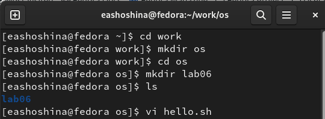
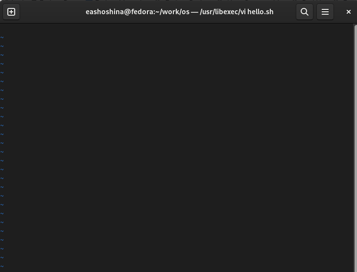
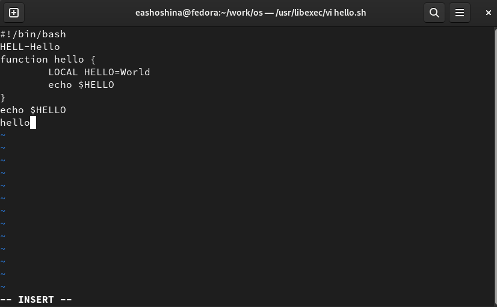
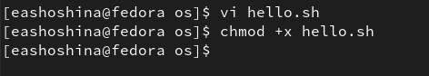
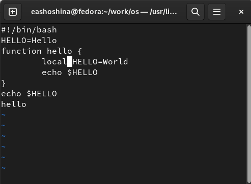
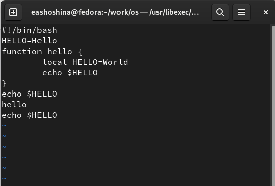
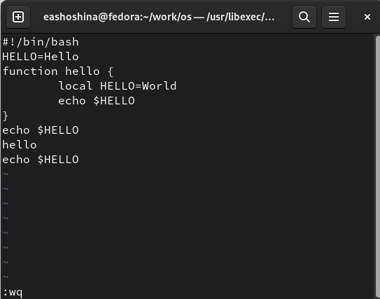

---
## Front matter
lang: ru-RU
title: Презентация по лабораторной работе №8
subtitle: "Дисциплина: Операционные системы"
author:
  - Шошина Е.А.
institute:
  - Российский университет дружбы народов, Москва, Россия
date: 29 марта 2023

## i18n babel
babel-lang: russian
babel-otherlangs: english

## Formatting pdf
toc: false
toc-title: Содержание
slide_level: 2
aspectratio: 169
section-titles: true
theme: metropolis
header-includes:
 - \metroset{progressbar=frametitle,sectionpage=progressbar,numbering=fraction}
 - '\makeatletter'
 - '\beamer@ignorenonframefalse'
 - '\makeatother'
---

# Информация

## Докладчик

:::::::::::::: {.columns align=center}
::: {.column width="70%"}

  * Шошина Евгения Александровна
  * группа: НКАбд-03-22
  * студент факультета физико-математических и естественных наук
  * Российский университет дружбы народов
  * [1132229532@pfur.ru](mailto:1132229532@pfur.ru)
  * <https://EAShoshina.github.io/ru/>

:::
::: {.column width="30%"}

:::
::::::::::::::

# Вводная часть

## Цель

Познакомиться с операционной системой Linux. Получить практические навыки работы с редактором vi, установленным по умолчанию практически во всех дистрибутивах.

## Задание

## Последовательность выполнения работы 
- 1. Ознакомиться с теоретическим материалом. 
- 2. Ознакомиться с редактором vi. 
- 3. Выполнить упражнения, используя
команды vi.

## Задание 1. Создание нового файла с использованием vi. 
- 1. Создайте каталог с именем ~/work/os/lab06. 
- 2. Перейдите во вновь созданный каталог. 
- 3. Вызовите vi и создайте файл hello.sh. 
- 4. Нажмите клавишу i и вводите следующий текст.
- 5. Нажмите клавишу Esc для перехода в командный режим после завершения
ввода текста. 
- 6. Нажмите : для перехода в режим последней строки и внизу вашего экрана появится приглашение в виде двоеточия. 
- 7. Нажмите w (записать) и q (выйти), а затем нажмите клавишу Enter для сохранения вашего текста и завершения работы. 
- 8. Сделайте файл исполняемым

## Задание 2. Редактирование существующего файла 
- 1. Вызовите vi на редактирование файла (vi ~/work/os/lab06/hello.sh) 
- 2. Установите курсор в конец слова HELL второй строки. 
- 3. Перейдите в режим вставки и замените на HELLO. Нажмите Esc для возврата в командный режим. 
- 4. Установите курсор на четвертую строку и сотрите слово LOCAL. 
- 5. Перейдите в режим вставки и наберите следующий текст: local, нажмите Esc для возврата в командный режим. 
- 6. Установите курсор на последней строке файла. Вставьте после неё строку, содержащую следующий текст: echo $HELLO. 
- 7. Нажмите Esc для перехода в командный режим. 
- 8. Удалите последнюю строку. 
- 9. Введите команду отмены изменений u для отмены последней команды. 
- 10. Введите символ : для перехода в режим последней строки. Запишите произведённые изменения и выйдите из vi.

# Теоретическое введение

В большинстве дистрибутивов Linux в качестве текстового редактора по умолчанию устанавливается интерактивный экранный редактор vi (Visual display editor).
Редактор vi имеет три режима работы: 
- командный режим — предназначен для ввода команд редактирования и навигации по редактируемому файлу; 
- режим вставки — предназначен для ввода содержания редактируемого файла; 
- режим последней (или командной) строки — используется для записи изменений в файл и выхода из редактора. 
Для вызова редактора vi необходимо указать команду vi и имя редактируемого файла: vi 
При этом в случае отсутствия файла с указанным именем будет создан такой файл. Переход в командный режим осуществляется нажатием клавиши Esc . 
Для выхода из редактора vi необходимо перейти в режим последней строки: находясь в командном режиме, нажать Shift-; (по сути символ : — двоеточие), затем: - набрать символы wq, если перед выходом из редактора требуется записать изменения в файл; - набрать символ q (или q!), если требуется выйти из редактора без сохранения.

# Выполнение лабораторной работы
## Последовательность выполнения работы 
- 1. Ознакомиться с теоретическим материалом. 
- 2. Ознакомиться с редактором vi. 
- 3. Выполнить упражнения, используя
команды vi.

# Задание 1. Создание нового файла с использованием vi. 

## 1. Создали каталог с именем ~/work/os/lab06. 2. Перешли во вновь созданный каталог. 3. Вызвали vi и создали файл hello.sh. 

## 4. Нажали клавишу i и ввели следующий текст.

## - 5. Нажали клавишу Esc для перехода в командный режим после завершения ввода текста. 6. Нажали : для перехода в режим последней строки и внизу нашего экрана появилось приглашение в виде двоеточия. 7. Нажали w (записать) и q (выйти), а затем нажали клавишу Enter для сохранения текста и завершения работы. 

## 8. Сделали файл исполняемым

# Задание 2. Редактирование существующего файла 

## 1. Вызвали vi на редактирование файла (vi ~/work/os/lab06/hello.sh) 2. Установили курсор в конец слова HELL второй строки. 3. Перешли в режим вставки и заменили на HELLO. Нажали Esc для возврата в командный режим. 4. Установили курсор на четвертую строку и стерли слово LOCAL. 5. Перешли в режим вставки и набрали следующий текст: local, нажали Esc для возврата в командный режим. 

## 6. Установили курсор на последней строке файла. Вставили после неё строку, содержащую следующий текст: echo $HELLO. 7. Нажали Esc для перехода в командный режим. 8. Удалили последнюю строку. 9. Ввели команду отмены изменений u для отмены последней команды. 

## 10. Ввели символ : для перехода в режим последней строки. Запишите произведённые изменения и выйдите из vi.

# Выводы

Познакомились с операционной системой Linux. Получили практические навыки работы с редактором vi, установленным по умолчанию практически во всех дистрибутивах.

# Контрольные вопросы

## 1. Дайте краткую характеристику режимам работы редактора vi.
- Командный режим — предназначен для ввода команд редактирования и навигации по редактируемому файлу;
- режим вставки — предназначен для ввода содержания редактируемого файла;
- режим последней (или командной) строки — используется для записи изменений в файл и выхода из редактора.

## 2. Как выйти из редактора, не сохраняя произведённые изменения?
- Можно нажимать символ q (или q!), если требуется выйти из редактора без сохранения.

## 3. Назовите и дайте краткую характеристику командам позиционирования.
- 0 (ноль) — переход в начало строки;
- $ — переход в конец строки;
- G — переход в конец файла;
- n G — переход на строку с номером n.

## 4. Что для редактора vi является словом?
- Редактор vi предполагает, что слово - это строка символов, которая может включать в себя буквы, цифры и символы подчеркивания.

## 5. Каким образом из любого места редактируемого файла перейти в начало (конец) файла?
- С помощью G — переход в конец файла.

## 6. Назовите и дайте краткую характеристику основным группам команд редактирования.
- Вставка текста – а — вставить текст после курсора; – А — вставить текст в конец строки; – i — вставить текст перед курсором; – n i — вставить текст n раз; – I — вставить текст в начало строки.
- Вставка строки – о — вставить строку под курсором; – О — вставить строку над курсором.
- Удаление текста – x — удалить один символ в буфер; – d w — удалить одно слово в буфер; – d $ — удалить в буфер текст от курсора до конца строки; – d 0 — удалить в буфер текст от начала строки до позиции курсора; – d d — удалить в буфер одну строку; – n d d — удалить в буфер n строк.
- Отмена и повтор произведённых изменений – u — отменить последнее изменение; – . — повторить последнее изменение.
- Копирование текста в буфер – Y — скопировать строку в буфер; – n Y — скопировать n строк в буфер; – y w — скопировать слово в буфер.
- Вставка текста из буфера – p — вставить текст из буфера после курсора; – P - вставить текст из буфера перед курсором.
- Замена текста – c w — заменить слово; – n c w — заменить n слов; – c $ — заменить текст от курсора до конца строки; – r — заменить слово; – R — заменить текст.
- Поиск текста – / текст — произвести поиск вперёд по тексту указанной строки символов текст; – ? текст — произвести поиск назад по тексту указанной строки символов текст. 

## 7. Необходимо заполнить строку символами $. Каковы ваши действия?
- Перейти в режим вставки.

## 8. Как отменить некорректное действие, связанное с процессом редактирования?
- С помощью u — отменить последнее изменение.

## 9. Назовите и дайте характеристику основным группам команд режима последней строки.
- Режим последней строки — используется для записи изменений в файл и выхода из редактора.

## 10. Как определить, не перемещая курсора, позицию, в которой заканчивается строка? 
- $ — переход в конец строки

## 11. Выполните анализ опций редактора vi (сколько их, как узнать их назначение
и т.д.).
- Опции редактора vi позволяют настроить рабочую среду. Для задания опций используется команда set (в режиме последней строки): – : set all — вывести полный список опций; – : set nu — вывести номера строк; – : set list — вывести невидимые символы; – : set ic — не учитывать при поиске, является ли символ прописным или строчным.

## 12. Как определить режим работы редактора vi?
- В редакторе vi есть два основных режима: командный режим и режим вставки. По умолчанию работа начинается в командном режиме. В режиме вставки клавиатура используется для набора текста. Для выхода в командный режим используется клавиша Esc или комбинация Ctrl + c.
