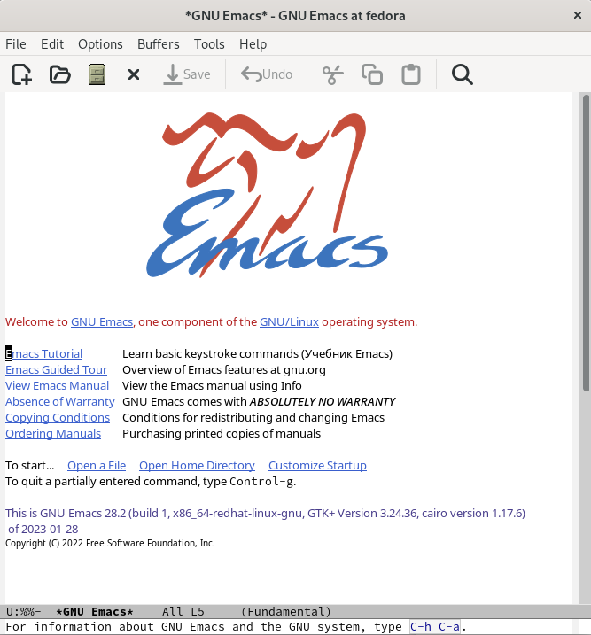
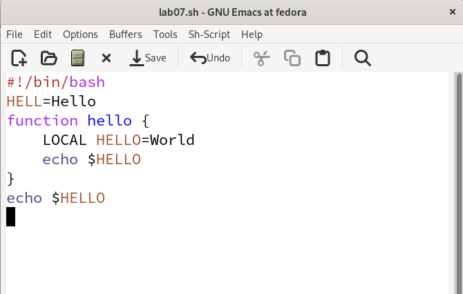
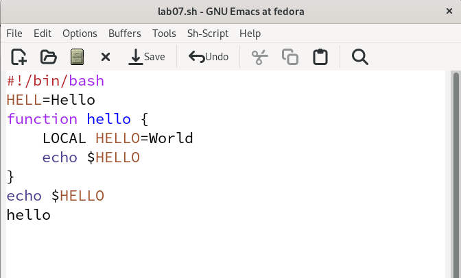
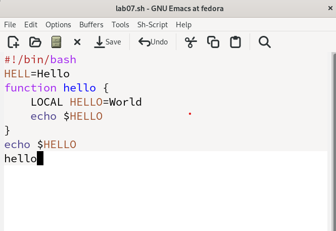
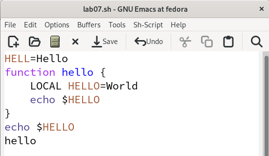
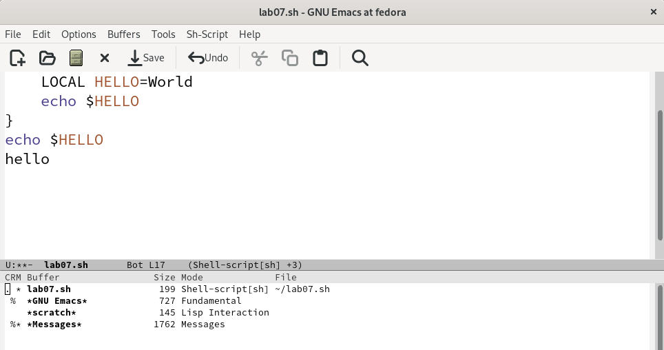
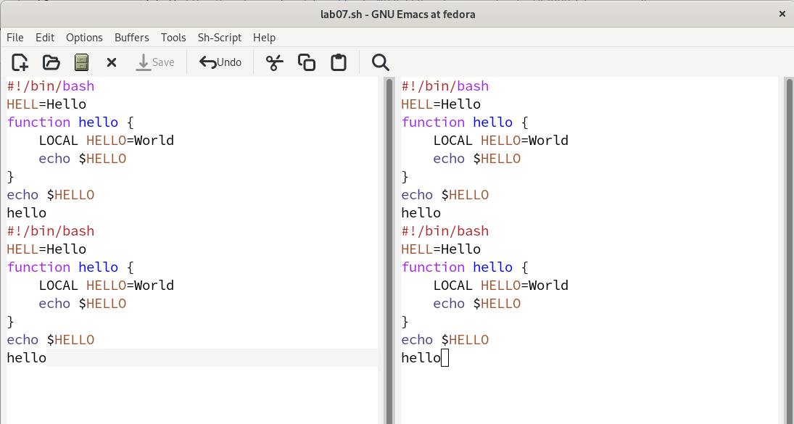
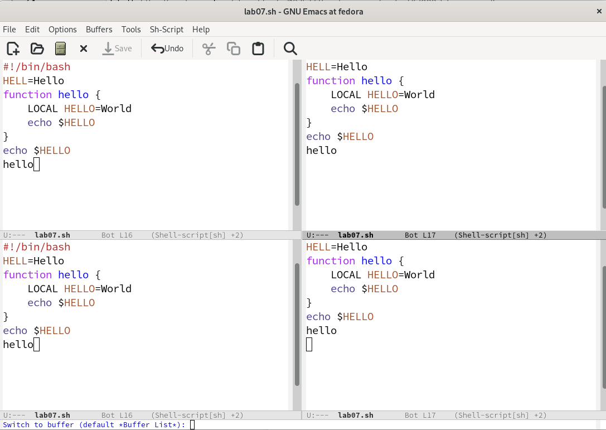
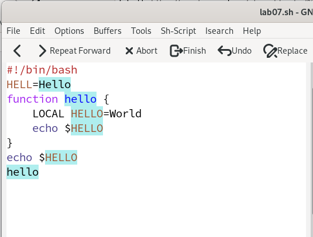
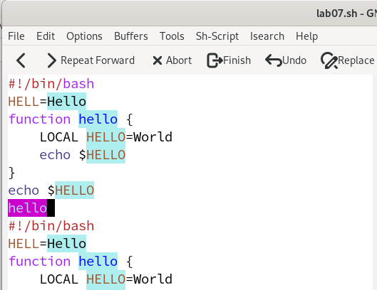

---
## Front matter
title: "Отчет по лабораторной работе №9"
subtitle: "Дисциплина: Операционные системы"
author: "Шошина Евгения Александровна (НКАбд-03-22)"

## Generic otions
lang: ru-RU
toc-title: "Содержание"

## Bibliography
bibliography: bib/cite.bib
csl: pandoc/csl/gost-r-7-0-5-2008-numeric.csl

## Pdf output format
toc: true # Table of contents
toc-depth: 2
lof: true # List of figures
lot: true # List of tables
fontsize: 12pt
linestretch: 1.5
papersize: a4
documentclass: scrreprt
## I18n polyglossia
polyglossia-lang:
  name: russian
  options:
	- spelling=modern
	- babelshorthands=true
polyglossia-otherlangs:
  name: english
## I18n babel
babel-lang: russian
babel-otherlangs: english
## Fonts
mainfont: PT Serif
romanfont: PT Serif
sansfont: PT Sans
monofont: PT Mono
mainfontoptions: Ligatures=TeX
romanfontoptions: Ligatures=TeX
sansfontoptions: Ligatures=TeX,Scale=MatchLowercase
monofontoptions: Scale=MatchLowercase,Scale=0.9
## Biblatex
biblatex: true
biblio-style: "gost-numeric"
biblatexoptions:
  - parentracker=true
  - backend=biber
  - hyperref=auto
  - language=auto
  - autolang=other*
  - citestyle=gost-numeric
## Pandoc-crossref LaTeX customization
figureTitle: "Рис."
tableTitle: "Таблица"
listingTitle: "Листинг"
lofTitle: "Список иллюстраций"
lotTitle: "Список таблиц"
lolTitle: "Листинги"
## Misc options
indent: true
header-includes:
  - \usepackage{indentfirst}
  - \usepackage{float} # keep figures where there are in the text
  - \floatplacement{figure}{H} # keep figures where there are in the text
---

# Цель работы

Познакомиться с операционной системой Linux. Получить практические навыки работы с редактором Emacs.

# Задание

## Последовательность выполнения работы 
1. Ознакомиться с теоретическим материалом. 
2. Ознакомиться с редактором emacs. 
3. Выполнить упражнения. 
4. Ответить на контрольные вопросы.

### Основные команды emacs 
1. Открыть emacs. 
2. Создать файл lab07.sh с помощью
комбинации Ctrl-x Ctrl-f (C-x C-f). 
3. Наберите текст, который дан. 
4. Сохранить файл с помощью комбинации Ctrl-x Ctrl-s (C-x C-s). 
5. Проделать с текстом стандартные процедуры редактирования, каждое действие должно осуществляться комбинацией клавиш. 
- 5.1. Вырезать одной командой целую строку (С-k). 
- 5.2. Вставить эту строку в конец файла (C-y). 5.3. Выделить область текста (C-space). 
- 5.4. Скопировать область в буфер обмена (M-w). 
- 5.5. Вставить область в конец файла.
- 5.6. Вновь выделить эту область и на этот раз вырезать её (C-w). 
- 5.7. Отмените последнее действие (C-/). 
6. Научитесь использовать команды по перемещению курсора. 
- 6.1. Переместите курсор в начало строки (C-a). 
- 6.2. Переместите курсор в конец строки (C-e). 
- 6.3. Переместите курсор в начало буфера (M-<). 
- 6.4. Переместите курсор в конец буфера (M->). 
7. Управление буферами. 
- 7.1. Вывести список активных буферов на экран (C-x C-b). 
- 7.2. Переместитесь во вновь открытое окно (C-x) o со списком открытых буферов и переключитесь на другой буфер. 
- 7.3. Закройте это окно (C-x 0). 
- 7.4. Теперь вновь переключайтесь между буферами, но уже без вывода их списка на экран (C-x b). 
8. Управление окнами. 
- 8.1. Поделите фрейм на 4 части: разделите фрейм на два окна по вертикали (C-x 3), а затем каждое из этих окон на две части по горизонтали (C-x 2). 
- 8.2. В каждом из четырёх созданных окон откройте новый буфер (файл) и введите несколько строк текста.
9. Режим поиска 
- 9.1. Переключитесь в режим поиска (C-s) и найдите несколько слов, присутствующих в тексте. 
- 9.2. Переключайтесь между результатами поиска, нажимая C-s. 
- 9.3. Выйдите из режима поиска, нажав C-g. 
- 9.4. Перейдите в режим поиска и замены (M-%), введите текст, который следует найти и заменить, нажмите Enter , затем введите текст для замены. После того как будут подсвечены результаты поиска, нажмите ! для подтверждения замены. 
- 9.5. Испробуйте другой режим поиска, нажав M-s o. Объясните, чем он отличается от обычного режима?

# Теоретическое введение

Emacs — один из наиболее мощных и широко распространённых редакторов, используемых в мире UNIX. По популярности он соперничает с редактором vi и его клонами. В зависимости от ситуации, Emacs может быть:
- текстовым редактором;
- программой для чтения почты и новостей Usenet;
- интегрированной средой разработки (IDE);
- операционной системой;
Всё это разнообразие достигается благодаря архитектуре Emacs, которая позволяет расширять возможности редактора при помощи языка Emacs Lisp. На языке C написаны лишь самые базовые и низкоуровневые части Emacs, включая полнофункциональный интерпретатор языка Lisp. Таким образом, Emacs имеет встроенный язык программирования, который может использоваться для настройки, расширения и изменения поведения редактора. В действительности, большая часть того редактора, с которым пользователи Emacs работают в наши дни, написана на языке Lisp.
Первая версия редактора Emacs была написана в 70-х годах 20-го столетия Richard Stallman (Ричардом Столманом) как набор макросов для редактора TECO. В дальнейшем, уже будучи основателем Фонда Свободного программного обеспечения Free Software Foundation и проекта GNU, Stallman разработал GNU Emacs в развитие оригинального Emacs и до сих пор сопровождает эту программу.
Emacs является одним из старейших редакторов. Он использовался тысячами программистов на протяжении последних 20 с лишним лет, для него создано много дополнительных пакетов расширений. Эти дополнения позволяют делать с помощью Emacs такие вещи, которые Stallman , вероятно, даже не считал возможными в начале своей работы над редактором. [1]

# Выполнение лабораторной работы
1. 1. Открыть emacs. 

2. Создать файл lab07.sh с помощью комбинации Ctrl-x Ctrl-f (C-x C-f). 

3. Наберите текст, который дан.
4. Сохранить файл с помощью комбинации Ctrl-x Ctrl-s (C-x C-s). 

5. Проделать с текстом стандартные процедуры редактирования, каждое действие должно осуществляться комбинацией клавиш. 5.1. Вырезать одной командой целую строку (С-k). 

- 5.2. Вставить эту строку в конец файла (C-y).

- 5.3. Выделить область текста (C-space). 

- 5.4. Скопировать область в буфер обмена (M-w). 
- 5.5. Вставить область в конец файла. 

- 5.6. Вновь выделить эту область и на этот раз вырезать её (C-w).

- 5.7. Отмените последнее действие (C-/).

6. Научитесь использовать команды по перемещению курсора. 6.1. Переместите курсор в начало строки (C-a). 
- 6.2. Переместите курсор в конец строки (C-e).
- 6.3. Переместите курсор в начало буфера (M-<). 6.4. Переместите курсор в конец буфера (M->). 

7. Управление буферами. 
- 7.1. Вывести список активных буферов на экран (C-x C-b). 

- 7.2. Переместитесь во вновь открытое окно (C-x) o со списком открытых буферов и переключитесь на другой буфер.

- 7.3. Закройте это окно (C-x 0). 
- 7.4. Теперь вновь переключайтесь между буферами, но уже без вывода их списка на экран (C-x b). 

8. Управление окнами. 
- 8.1. Поделите фрейм на 4 части: разделите фрейм на два окна по вертикали (C-x 3), а затем каждое из этих окон на две части по горизонтали (C-x 2). 

- 8.2. В каждом из четырёх созданных окон откройте новый буфер (файл) и введите несколько строк текста.

9. Режим поиска 
- 9.1. Переключитесь в режим поиска (C-s) и найдите несколько слов, присутствующих в тексте.

- 9.2. Переключайтесь между результатами поиска, нажимая C-s.

- 9.3. Выйдите из режима поиска, нажав C-g. 
- 9.4. Перейдите в режим поиска и замены (M-%), введите текст, который следует найти и заменить, нажмите Enter, затем введите текст для замены. После того как будут подсвечены результаты поиска, нажмите ! для подтверждения замены. 
- 9.5. Испробуйте другой режим поиска, нажав M-s o. Объясните, чем он отличается от обычного режима?

###### Отличие от обычного режима в том, что тут появляется отдельное окно с текстом из файла с выделенными словами, которые нужно было найти.

# Выводы

В процессе выполнения лабораторной работы я получила практические навыки работы в редакторе Emacs.

# Контрольные вопросы

1. Кратко охарактеризуйте редактор emacs.
- Emacs — один из наиболее мощных и широко распространённых редакторов, используемых в мире UNIX. Написан на языке высокого уровня Lisp.
2. Какие особенности данного редактора могут сделать его сложным для освоения новичком?
- Большое разнообразие сложных комбинаций клавиш, которые необходимы для редактирования файла и в принципе для работа с Emacs.
3. Своими словами опишите, что такое буфер и окно в терминологии emacs’а.
- Буфер - это объект в виде текста. Окно - это прямоугольная область, в которой отображен буфер.
4. Можно ли открыть больше 10 буферов в одном окне?
- Да, можно.
5. Какие буферы создаются по умолчанию при запуске emacs?
- Emacs использует буферы с именами, начинающимися с пробела, для внутренних целей. Отчасти он обращается с буферами с такими именами особенным образом – например, по умолчанию в них не записывается информация для отмены изменений.
6. Какие клавиши вы нажмёте, чтобы ввести следующую комбинацию C-c | и C-c C-|?
- Ctrl + c, а потом -  | и Ctrl + c Ctrl + |
7. Как поделить текущее окно на две части?
- С помощью команды Ctrl + x 3 (по вертикали) и Ctrl + x 2 (по горизонтали).
8. В каком файле хранятся настройки редактора emacs?
- Настройки emacs хранятся в файле . emacs, который хранится в домашней директории пользователя. Кроме этого файла есть ещё папка . emacs.
9. Какую функцию выполняет клавиша и можно ли её переназначить?
- Выполняет функцию стереть, думаю можно переназначить.
10. Какой редактор вам показался удобнее в работе vi или emacs? Поясните, почему.
- Для меня удобнее был редактор Emacs, так как у него есть командая оболочка. А vi открывается в терминале, и выглядит своеобразно.
