---
## Front matter
lang: ru-RU
title: Отчет о выполнении 2 этапа индивидуального проекта
subtitle: "Дисциплина: Операционные системы"
author:
  - Шошина Е.А.
institute:
  - Российский университет дружбы народов, Москва, Россия
date: 18 марта 2023

## i18n babel
babel-lang: russian
babel-otherlangs: english

## Formatting pdf
toc: false
toc-title: Содержание
slide_level: 2
aspectratio: 169
section-titles: true
theme: metropolis
header-includes:
 - \metroset{progressbar=frametitle,sectionpage=progressbar,numbering=fraction}
 - '\makeatletter'
 - '\beamer@ignorenonframefalse'
 - '\makeatother'
---

# Информация

## Докладчик

:::::::::::::: {.columns align=center}
::: {.column width="70%"}

  * Шошина Евгения Александровна
  * группа: НКАбд-03-22
  * студент факультета физико-математических и естественных наук
  * Российский университет дружбы народов
  * [1132229532@pfur.ru](mailto:1132229532@pfur.ru)
  * <https://EAShoshina.github.io/ru/>

:::
::: {.column width="30%"}

:::
::::::::::::::

# Вводная часть

## Цель

Добавить к сайту данные о себе.

## Задание

- Разместить фотографию владельца сайта.
- Разместить краткое описание владельца сайта (Biography).
- Добавить информацию об интересах (Interests).
- Добавить информацию от образовании (Education).
- Сделать пост по прошедшей неделе.
- Добавить пост на тему по выбору: Управление версиями. Git или Непрерывная интеграция и непрерывное развертывание (CI/CD).

# Выполнение лабораторной работы

## 1. Открыли терминал в папке blog терминал, ввели команду hugo server и провели загрузку.

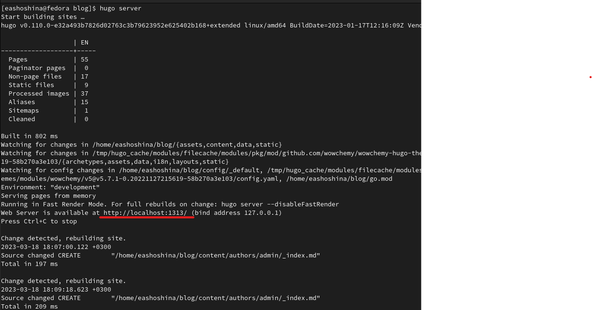

## 2. Открыли папку blog/content/authors/admin и открыли файл index.

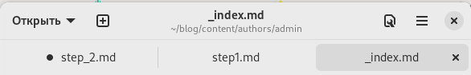

# 3. Заполнили информацию о себе в index.md

## Разместили фотографию владельца сайта.

## Разместили краткое описание владельца сайта (Biography).

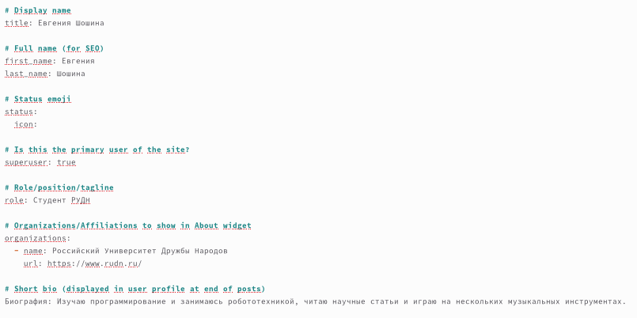

## Добавили информацию об интересах (Interests).

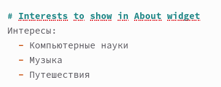

## Добавили информацию от образовании (Education).

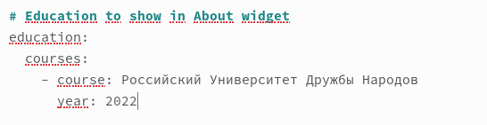

## Написали пост по прошедшей неделе.

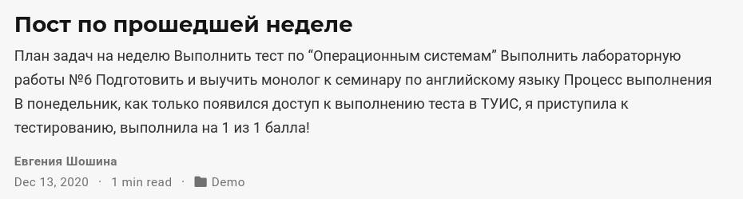

## Написали пост на тему: Управление версиями. Git.

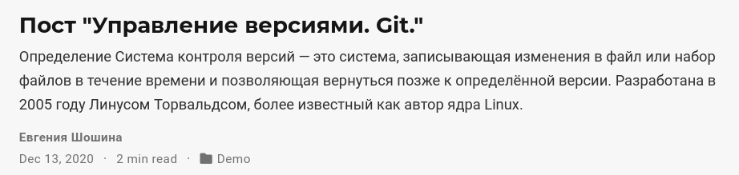

## 4. Ввели команду hugo в терминале

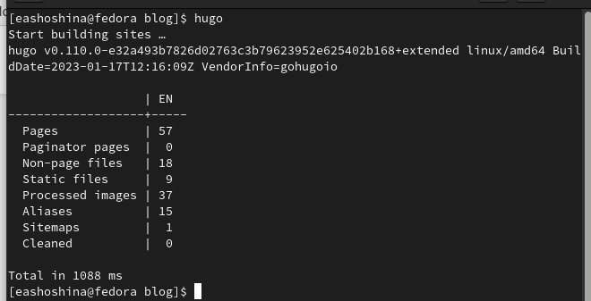

## 5. Отправили на GitHub

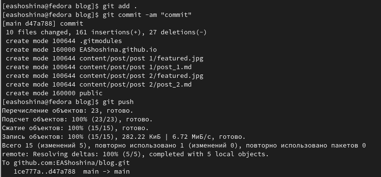

## 6. Отправили на GitHub public

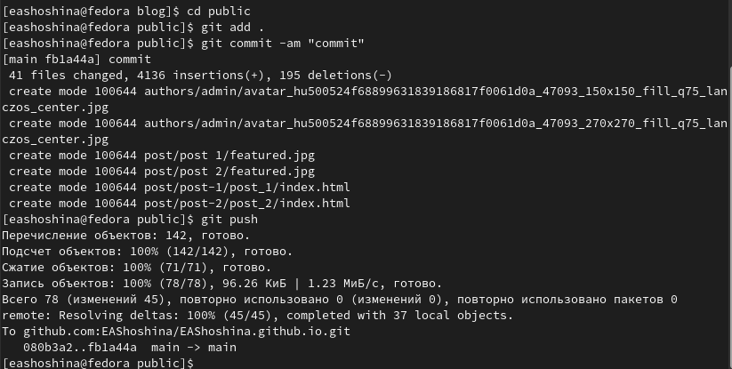

## 7. Открыли свой сайт

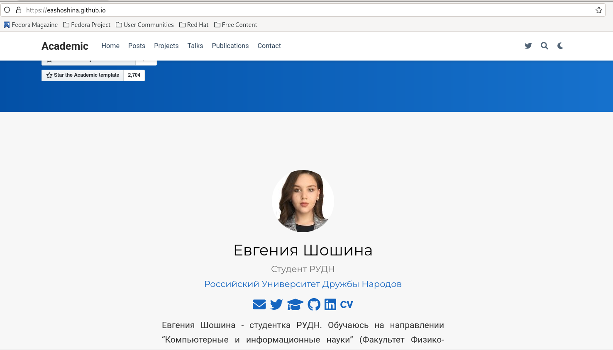

# Выводы

Добавили к сайту данные о себе.

