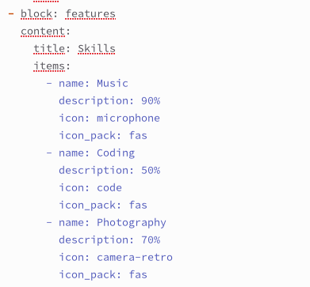
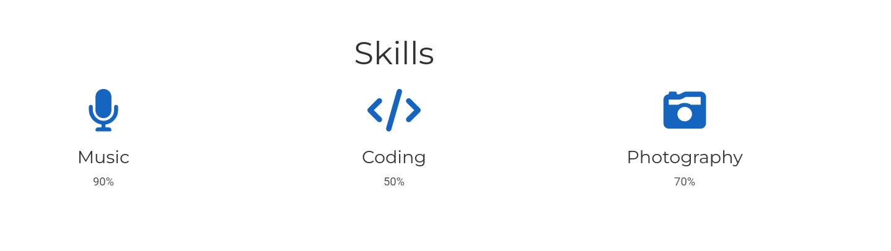
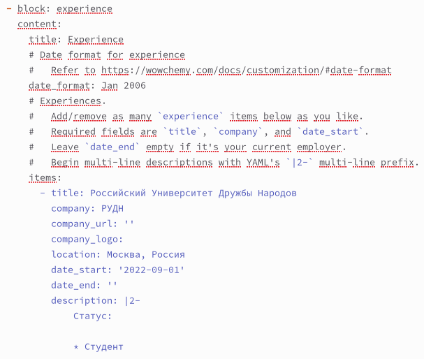
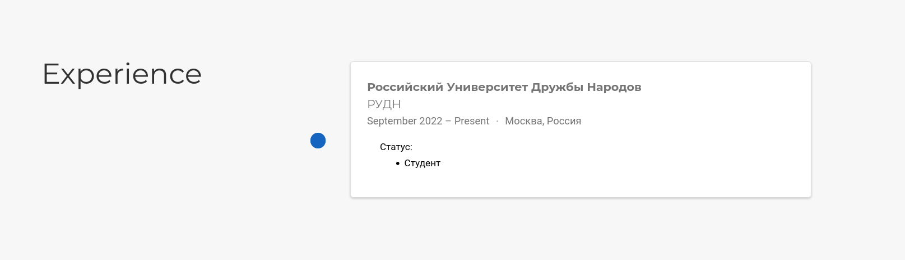
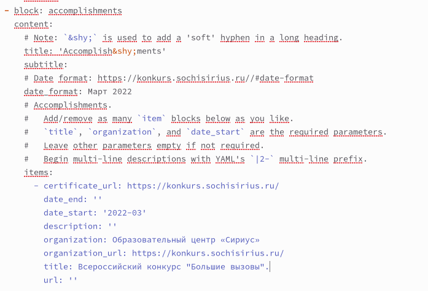
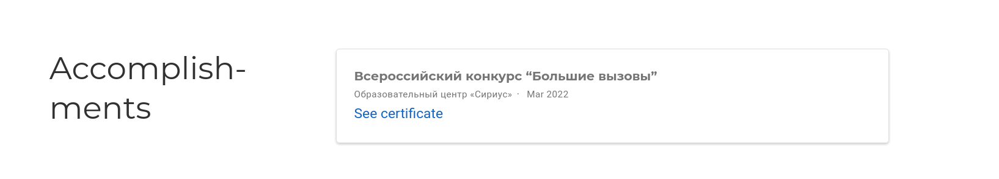
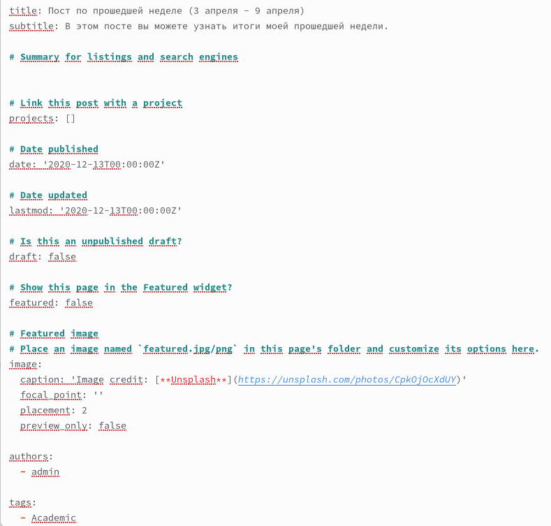
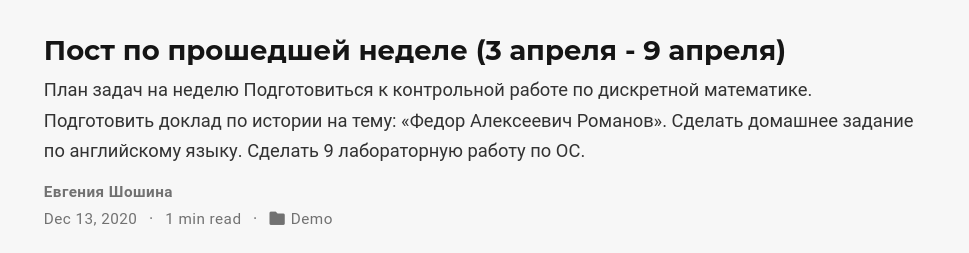
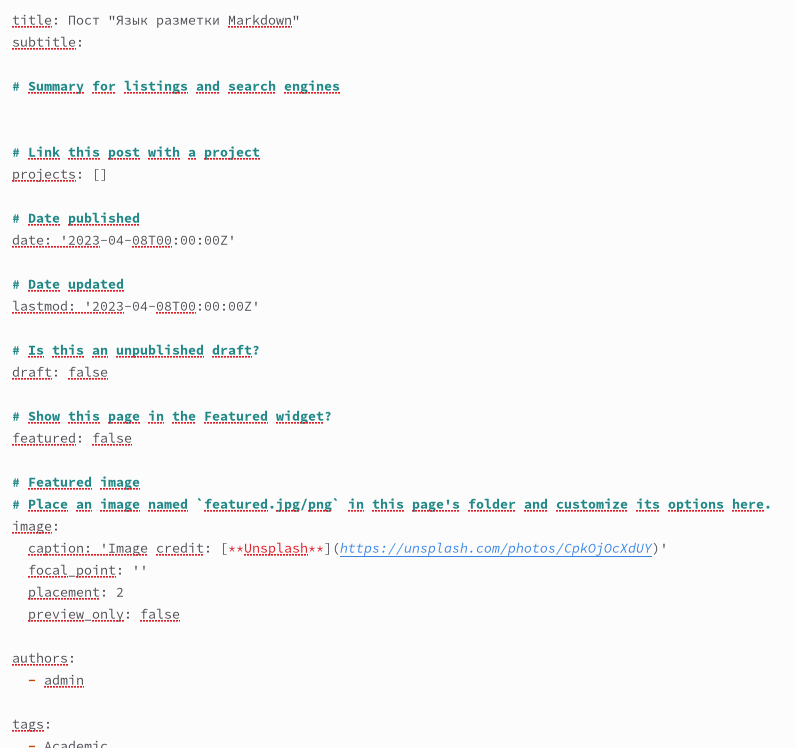
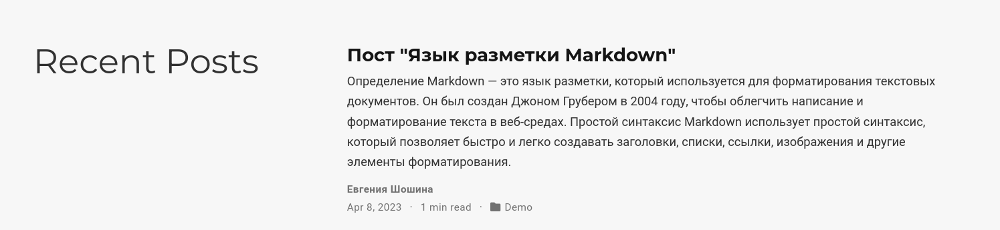

---
## Front matter
lang: ru-RU
title: Отчет о выполнении 3 этапа индивидуального проекта
subtitle: "Дисциплина: Операционные системы"
author:
  - Шошина Е.А.
institute:
  - Российский университет дружбы народов, Москва, Россия
date: 8 апреля 2023

## i18n babel
babel-lang: russian
babel-otherlangs: english

## Formatting pdf
toc: false
toc-title: Содержание
slide_level: 2
aspectratio: 169
section-titles: true
theme: metropolis
header-includes:
 - \metroset{progressbar=frametitle,sectionpage=progressbar,numbering=fraction}
 - '\makeatletter'
 - '\beamer@ignorenonframefalse'
 - '\makeatother'
---

# Информация

## Докладчик

:::::::::::::: {.columns align=center}
::: {.column width="70%"}

  * Шошина Евгения Александровна
  * группа: НКАбд-03-22
  * студент факультета физико-математических и естественных наук
  * Российский университет дружбы народов
  * [1132229532@pfur.ru](mailto:1132229532@pfur.ru)
  * <https://EAShoshina.github.io/ru/>

:::
::: {.column width="30%"}

:::
::::::::::::::

# Вводная часть

## Цель

Добавить к информации о себе на сайте "достижения".

## Задание

1. Добавить информацию о навыках (Skills).
2. Добавить информацию об опыте (Experience).
3. Добавить информацию о достижениях (Accomplishments).
4. Сделать пост по прошедшей неделе.
5. Добавить пост на тему по выбору:
- Легковесные языки разметки.
- Языки разметки. LaTex.
- Язык разметки Markdown

# Выполнение лабораторной работы

## 1. Добавить информацию о навыках (Skills).

## 2. Добавить информацию об опыте (Experience).

# 3. Добавить информацию о достижениях (Accomplishments).

## 4. Сделать пост по прошедшей неделе.

## 5. Добавим пост на тему “Язык разметки Markdown.” 

 

# Выводы

В процессе выполнения третьего этапа индивидуального проекта я продолжила редактирование сайта, научилась добавлять на сайт свои достижения, а также продолжила писать посты.

