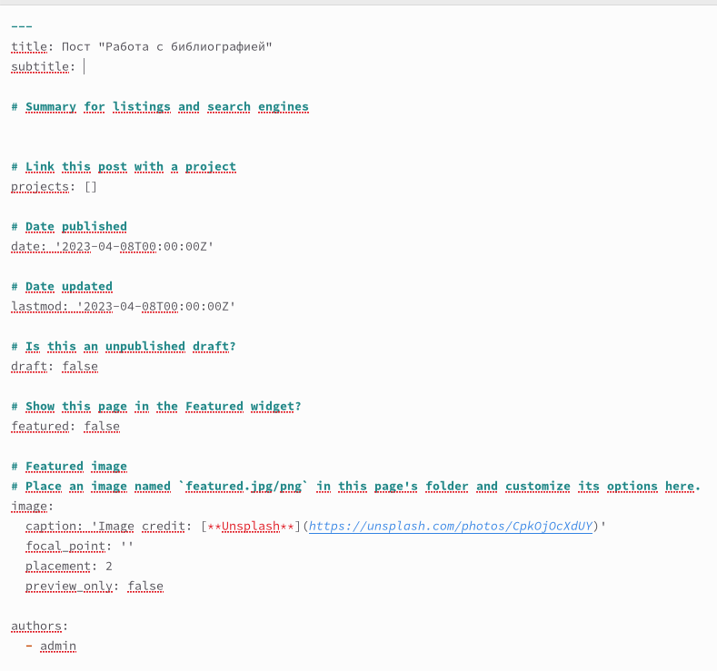
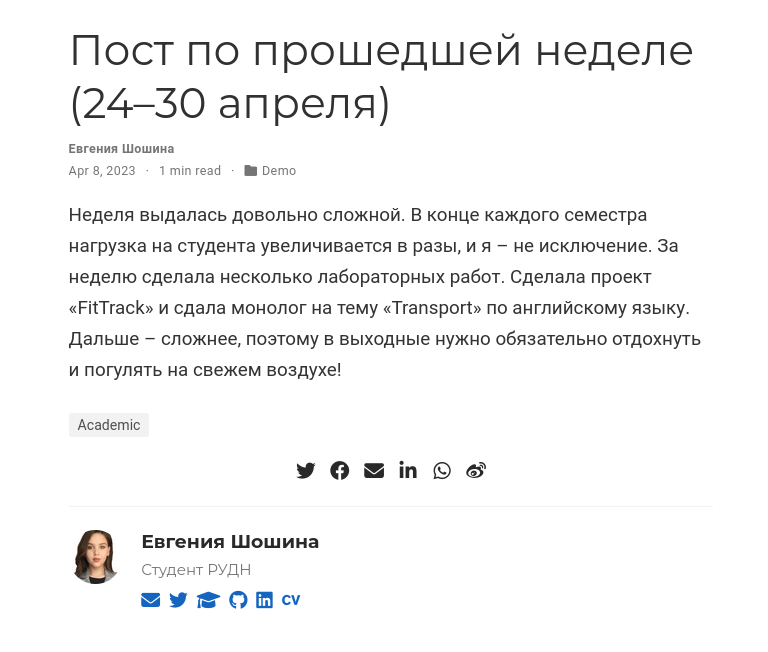
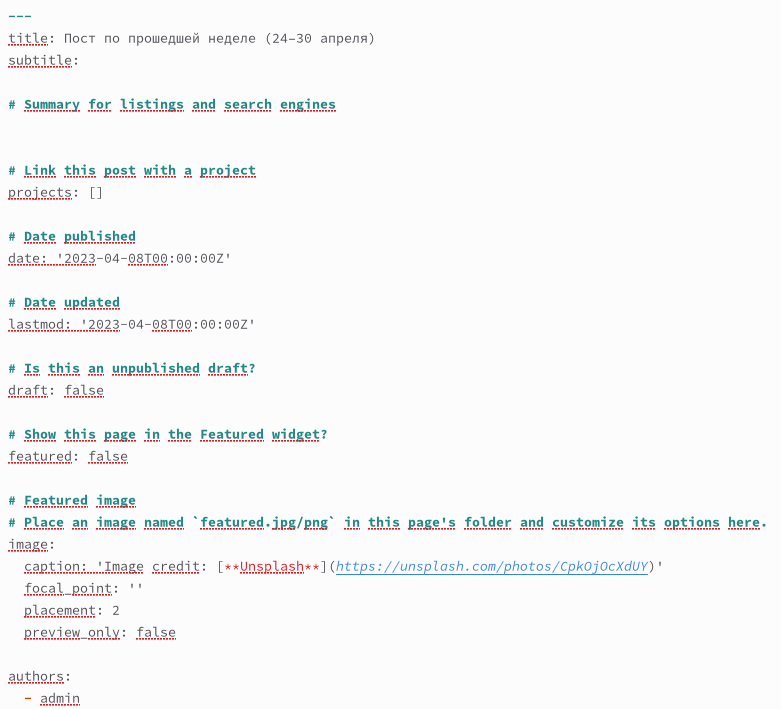
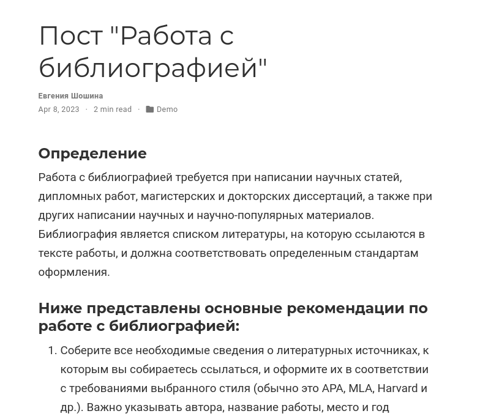
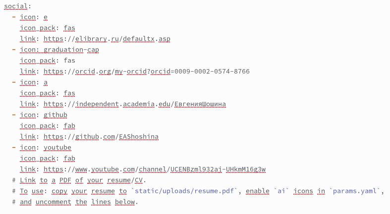
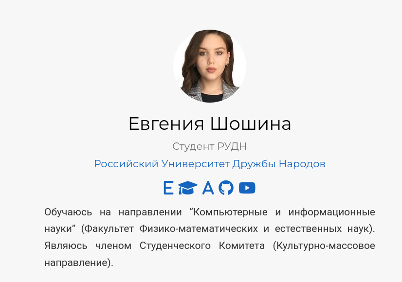

---
## Front matter
lang: ru-RU
title: Отчет о выполнении 4 этапа индивидуального проекта
subtitle: "Дисциплина: Операционные системы"
author:
  - Шошина Е.А.
institute:
  - Российский университет дружбы народов, Москва, Россия
date: 29.04.2023

## i18n babel
babel-lang: russian
babel-otherlangs: english

## Formatting pdf
toc: false
toc-title: Содержание
slide_level: 2
aspectratio: 169
section-titles: true
theme: metropolis
header-includes:
 - \metroset{progressbar=frametitle,sectionpage=progressbar,numbering=fraction}
 - '\makeatletter'
 - '\beamer@ignorenonframefalse'
 - '\makeatother'
---

# Информация

## Докладчик

:::::::::::::: {.columns align=center}
::: {.column width="70%"}

  * Шошина Евгения Александровна
  * группа: НКАбд-03-22
  * студент факультета физико-математических и естественных наук
  * Российский университет дружбы народов
  * [1132229532@pfur.ru](mailto:1132229532@pfur.ru)
  * <https://EAShoshina.github.io/ru/>

:::
::: {.column width="30%"}

:::
::::::::::::::

## Цель работы

Добавить к сайту ссылки на научные и библиометрические ресурсы.

# Задание

## 1. Зарегистрироваться на соответствующих ресурсах и разместить на них ссылки на сайте:
- eLibrary : https://elibrary.ru/;
- Google Scholar : https://scholar.google.com/;
- ORCID : https://orcid.org/;
- Mendeley : https://www.mendeley.com/;
- ResearchGate : https://www.researchgate.net/;
- Academia.edu : https://www.academia.edu/;
- arXiv : https://arxiv.org/;
- github : https://github.com/.

## Задание

2. Сделать пост по прошедшей неделе.
3. Добавить пост на тему по выбору:
- Оформление отчёта.
- Создание презентаций.
- Работа с библиографией.

## Теоретическое введение

- Сайт – это совокупность веб-страниц, объединённых под общим доменом и связанных ссылками, тематикой и дизайнерским оформлением. 
- Мы создали статический сайт с помощью Hugo. 
- Hugo — генератор статических страниц для интернета.
- В этом этапе я напишу пост про оформление отчета. 
- Отчет — это структурированное сообщение о результатах вашей работы, которое вы делаете в устной или письменной форме.

# Выполнение лабораторной работы

## 1. Разместим ссылки на научные ресурсы (гитхаб, ютуб) на сайте.

{ #fig:001 width=70% height=70%}

## 1. Разместим ссылки на научные ресурсы (гитхаб, ютуб) на сайте.

{ #fig:002 width=70% height=70%}

## 2. Сделали пост по прошедшей неделе.

{ #fig:003 width=70% height=70%}

## 2. Сделали пост по прошедшей неделе.

{ #fig:004 width=70% height=70%} 

## 3. Добавили пост на тему "Работа с библиографией".

{ #fig:005 width=70% height=70%}

## 3. Добавили пост на тему "Работа с библиографией".

{ #fig:006 width=70% height=70%}  

## Выводы

В процессе выполнения этого этапа проекта добавили на сайт ссылки на свои научные аккаунты, а также написали два поста.

