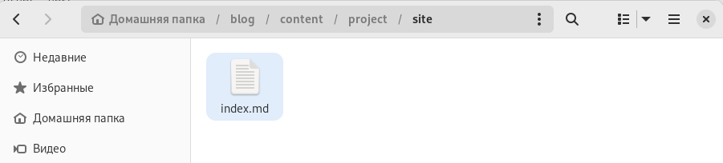
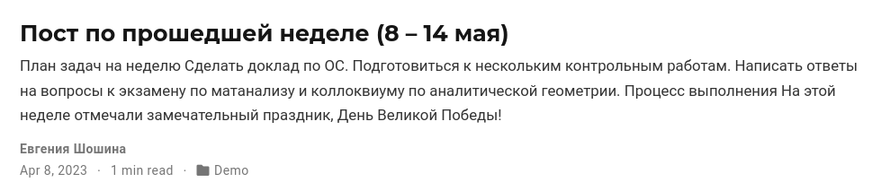
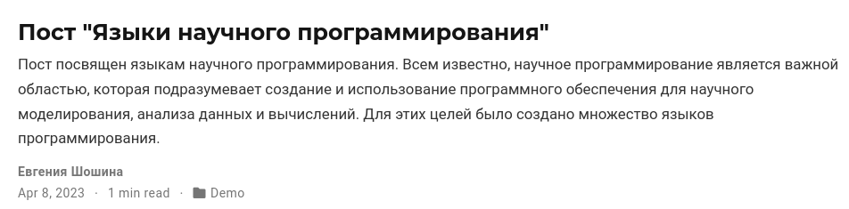

---
## Front matter
lang: ru-RU
title: Отчет о выполнении 5 этапа индивидуального проекта
subtitle: "Дисциплина: Операционные системы"
author:
  - Шошина Е.А.
institute:
  - Российский университет дружбы народов, Москва, Россия
date: 13.05.2023

## i18n babel
babel-lang: russian
babel-otherlangs: english

## Formatting pdf
toc: false
toc-title: Содержание
slide_level: 2
aspectratio: 169
section-titles: true
theme: metropolis
header-includes:
 - \metroset{progressbar=frametitle,sectionpage=progressbar,numbering=fraction}
 - '\makeatletter'
 - '\beamer@ignorenonframefalse'
 - '\makeatother'
---

# Информация

## Докладчик

:::::::::::::: {.columns align=center}
::: {.column width="70%"}

  * Шошина Евгения Александровна
  * группа: НКАбд-03-22
  * студент факультета физико-математических и естественных наук
  * Российский университет дружбы народов
  * [1132229532@pfur.ru](mailto:1132229532@pfur.ru)
  * <https://EAShoshina.github.io/ru/>

:::
::: {.column width="30%"}

:::
::::::::::::::

## Цель работы

Добавить с сайту все остальные элементы.

## Задание

1. Сделать записи для персональных проектов.
2. Сделать пост по прошедшей неделе.
3. Добавить пост на тему: Языки научного программирования.

## Теоретическое введение

- Сайт – это совокупность веб-страниц, объединённых под общим доменом и связанных ссылками, тематикой и дизайнерским оформлением. 
- Мы создали статический сайт с помощью Hugo. 
- Hugo — генератор статических страниц для интернета.
- В этом этапе я напишу пост про оформление отчета. 
- Отчет — это структурированное сообщение о результатах вашей работы, которое вы делаете в устной или письменной форме.

# Выполнение лабораторной работы

## 1. Сделали записи для персональных проектов.

{ #fig:001 width=70% height=70%}

## 2. Сделали пост по прошедшей неделе.

{ #fig:003 width=70% height=70%}

## 3. Добавили пост на тему: "Языки научного программирования".

{ #fig:003 width=70% height=70%}

## Выводы

В процессе выполнения этого этапа проекта Добавить с сайту все остальные элементы: записи для персональных проектов, пост по прошедшей неделе, пост на тему: "Языки научного программирования".

## Список литературы{.unnumbered}

1. Что такое сайт (простыми словами). URL: https://uguide.ru/chto-takoe-sajt-prostymi-slovami.

